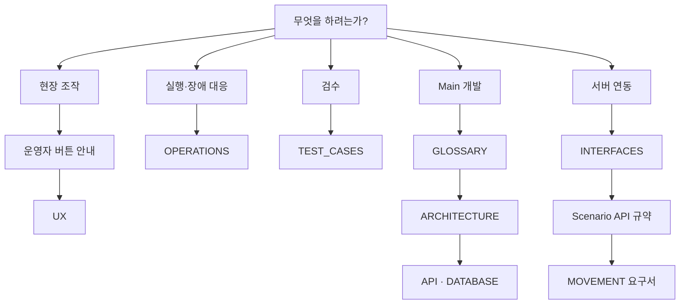

# Documentation Index

상태: Active
주 독자: 신규 참여자·평가자·문서 탐색자
보조 독자: 전체 프로젝트 구성원
난이도: 입문
소유: Docs
최종 갱신: 2026-07-16 20:50 KST
구현 기준: 현재 추적 중인 공개 문서와 저장소 경로
목적: GitHub 공개 정본 목차와 권장 읽기 순서.

공개 정본은 아래 목록으로 관리한다. 상세 설계 노트·의사결정 기록(ADR)·팀 정책 문서는 팀 내부에서 관리한다.

## 공개 정본

| 문서 | 주 독자 | 난이도 | 읽고 판단할 것 |
| --- | --- | --- | --- |
| [../README.md](../README.md) | 신규 참여자·평가자 | 입문 | 프로젝트 목적과 실행 진입점 |
| 본 README | 전체 독자 | 입문 | 내 역할에 맞는 정본 선택 |
| [운영자 버튼 빠른 안내](OPERATOR_BUTTON_GUIDE.md) | 현장 운영자 | 입문 | 버튼 의미와 다음 행동 |
| [UX](UX.md) | 기획·Frontend·QA | 운영 | 화면 구조와 상태 표현 |
| [UI/UX Design](UI_UX_DESIGN.md) | 기획·디자인·발표자 | 운영 | 스크린샷과 통합 Draw.io 중심 화면 기능·디자인 의도 |
| [OPERATIONS](OPERATIONS.md) | 배포·운영 담당자 | 운영 | 실행·진단·복구 절차 |
| [TEST_CASES](TEST_CASES.md) | QA·인수 검수자 | 운영 | 합격 조건과 증적 |
| [GLOSSARY](GLOSSARY.md) | 전체 개발자 | 개발 | canonical 용어와 상태 축 |
| [ARCHITECTURE](ARCHITECTURE.md) | Main 개발자 | 개발 | 서버·도메인 책임 |
| [DATABASE](DATABASE.md) | Backend·DB 담당자 | 개발 | 데이터 SoT와 수명주기 |
| [API](API.md) | Main·Frontend 개발자 | 개발 | Browser→Main REST 경계 |
| [INTERFACES](INTERFACES.md) | 서버 연동 개발자 | 연동 | Main↔외부 서버 계약 |
| [Movement Scenario API Contract](MOVEMENT_SCENARIO_API_CONTRACT.md) | Main·Movement 개발자 | 연동 | 입출고 단일 실행·업무 단계·callback 정본 |
| [MOVEMENT_SERVER_REQUIREMENTS](MOVEMENT_SERVER_REQUIREMENTS.md) | Movement 개발자 | 연동 | callback·재시도·ESTOP 요구 |

## 독자별 읽기 순서

| 목적 | 먼저 읽을 문서 | 다음 문서 |
| --- | --- | --- |
| 프로젝트 평가 | [README](../README.md) | [UX](UX.md) · [ARCHITECTURE](ARCHITECTURE.md) |
| 현장 버튼 빠른 확인 | [운영자 버튼 빠른 안내](OPERATOR_BUTTON_GUIDE.md) | [UX](UX.md) · [OPERATIONS](OPERATIONS.md) |
| 로컬 실행·장애 대응 | [OPERATIONS](OPERATIONS.md) | [Database](DATABASE.md) |
| 시스템 구조 파악 | [GLOSSARY](GLOSSARY.md) | [ARCHITECTURE](ARCHITECTURE.md) · [INTERFACES](INTERFACES.md) |
| API 연동 | [API](API.md) | [INTERFACES](INTERFACES.md) · [Scenario API 규약](MOVEMENT_SCENARIO_API_CONTRACT.md) · [Movement 요구서](MOVEMENT_SERVER_REQUIREMENTS.md) |

README는 프로젝트 요약만, OPERATIONS는 실행 명령과 현장 절차만, TEST_CASES는 상태 정책과 검증 근거만 소유한다. 같은 내용을 여러 문서에 반복하지 않는다.

## 난이도와 분량 기준

| 난이도 | 작성 기준 | 권장 읽기 방식 |
| --- | --- | --- |
| 입문 | 화면 문구와 행동 중심, 내부 구현 최소화 | 처음부터 순서대로 |
| 운영 | 전제조건·절차·장애 분기·완료 기준 | 필요한 절을 runbook처럼 |
| 개발 | 책임·상태·데이터 흐름과 구현 경계 | Mermaid 후 상세 절 |
| 연동 | 호출 방향·필수 필드·ACK·재시도 | 계약표와 예시 중심 |

공개 정본은 한 문서가 지나치게 커지지 않도록 역할별로 나눈다. 필드 전체 목록은 OpenAPI, 테이블 전체 정의는
DDL을 정본으로 두고 문서에는 판단에 필요한 흐름과 경계만 남긴다.

## 유지 기준

- 문서마다 상태·주 독자·보조 독자·난이도·소유자·갱신 시각·구현 기준·목적을 둔다. `Draft`는 미확정,
  `Approved`는 합의됐지만 구현 전환 중인 계약, `Active`는 현재 코드와 운영 기준이다.
- 코드·DDL·OpenAPI처럼 실행 가능한 산출물을 정본으로 두고, 문서는 의도·경계·사용법을 설명한다.
- 구현된 기능, 미검증 항목, 향후 제안을 섞지 않는다. 미구현·미검증은 해당 문서에서 명시한다.
- 같은 표나 절차를 복사하지 않고 정본 링크로 연결한다. 새 문서는 독립된 독자와 책임이 있을 때만 만든다.
- 변경 후 `bash ./scripts/check.sh docs`로 링크·메타데이터·코드 드리프트를 확인한다.
- 화면 캡처는 실행 중인 Main, Chrome, 데스크톱 라이트 테마를 기준으로 하며 UI 구조가 바뀐 변경에서
  `docs/assets/screens`의 연결 이미지를 함께 갱신한다. 촬영 과정은 실제 로봇 명령을 실행하지 않는다.
- 문서 화면은 `npx playwright test tests/e2e/capture-docs.spec.ts`로 재생성한다. 촬영 테스트는 조회 route만
  열고 실제 로봇 명령을 실행하지 않는다.

| 변경 | 함께 검토할 정본 |
| --- | --- |
| API route·Pydantic schema·오류 계약 | [API](API.md), 외부 계약이면 [INTERFACES](INTERFACES.md) |
| DB table·constraint·migration | [DATABASE](DATABASE.md), [OPERATIONS](OPERATIONS.md) |
| 업무 흐름·용어·서버 책임·상태 전이 | [GLOSSARY](GLOSSARY.md), [ARCHITECTURE](ARCHITECTURE.md), [TEST_CASES](TEST_CASES.md) |
| 메뉴·조작·상태 표현 | [UX](UX.md), [TEST_CASES](TEST_CASES.md) |
| Confluence·PPT 화면 설명 | [UI/UX Design](UI_UX_DESIGN.md), [UX](UX.md) |
| 실행·환경변수·복구·배포 | [OPERATIONS](OPERATIONS.md), 필요 시 루트 README |
