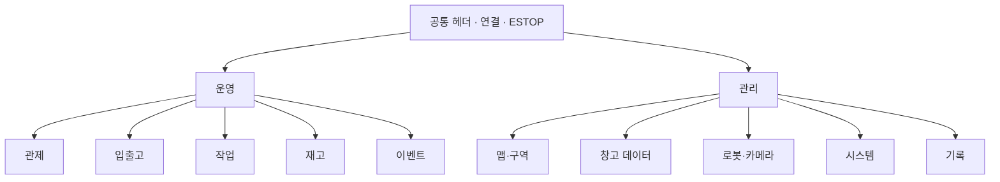
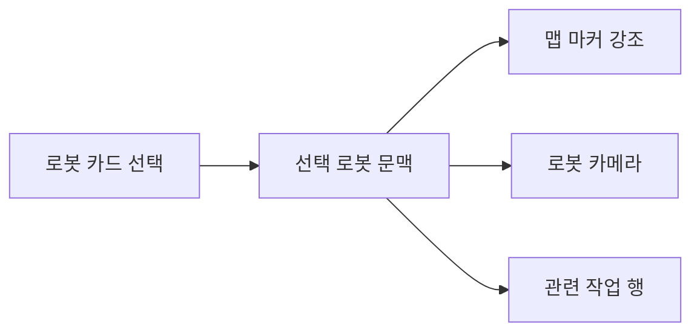
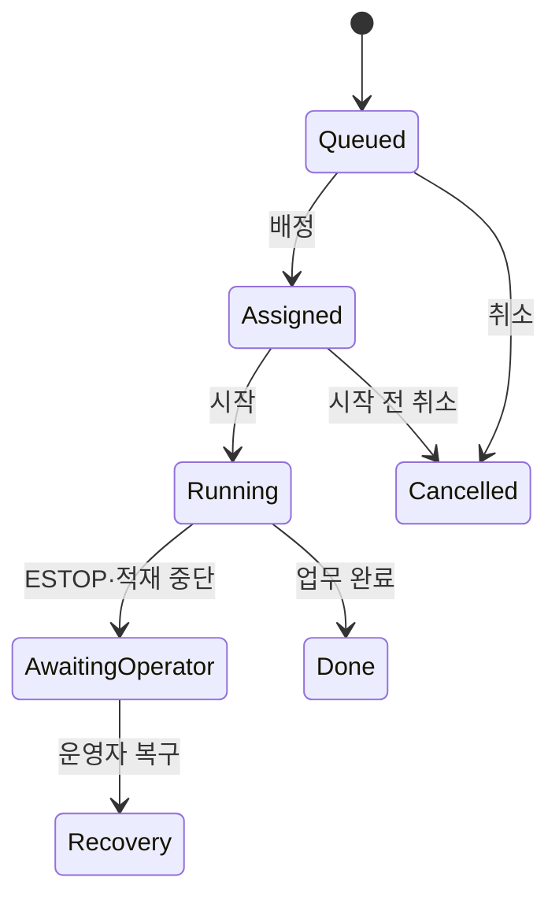
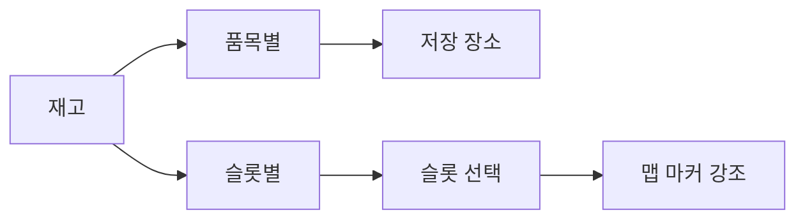
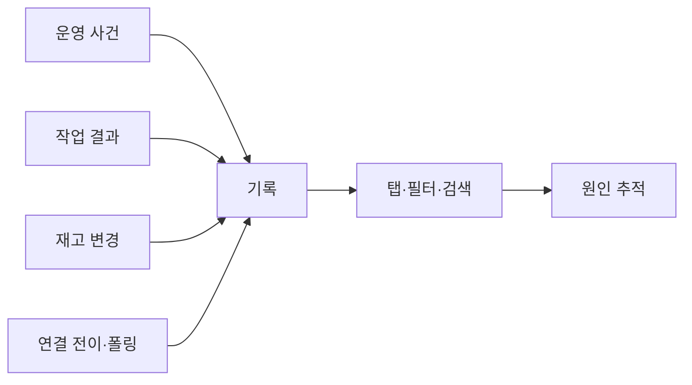
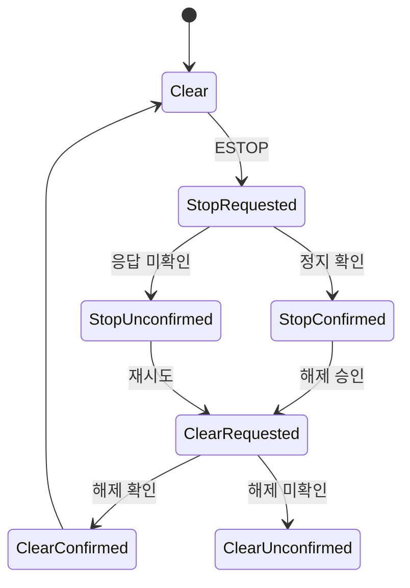
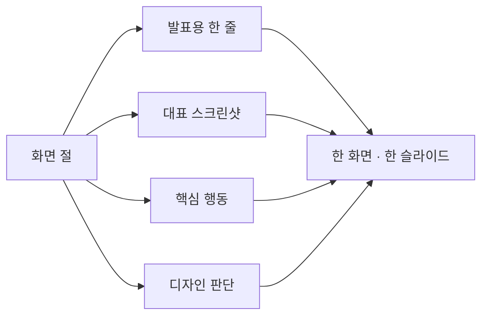

# UI/UX Design

상태: Active
주 독자: 제품 기획자·UI/UX 디자이너·Frontend 개발자
보조 독자: 현장 관리자·QA·기술 발표자
난이도: 운영
소유: Frontend · Product
최종 갱신: 2026-07-16 16:00 KST
구현 기준: 2026-07-16 17:37 KST Main 8088과 docs/assets/screens/current 화면
목적: 화면별 기능·디자인 의도·사용자 흐름을 스크린샷 중심으로 설명하고 Confluence와 PPT에서 재사용한다.

이 문서는 구현된 화면의 visual specification이다. 화면 구조의 정본은 [UX](UX.md), 인수 조건은
[TEST_CASES](TEST_CASES.md), 공통 시각 규칙은
[Frontend Design System](../frontend/web/docs/DESIGN_SYSTEM.md)에서 관리한다.

화면 이미지는 최신 frontend production build를 Main에서 서빙한 뒤 실제 route를 열어 촬영했다. 이미지 경로를
`screens/current`로 분리해 Confluence·브라우저의 기존 파일 캐시와 구분한다. 촬영 당시 외부 서비스의 실제
연결·데이터 상태는 화면에 그대로 포함하며, 촬영을 위해 로봇 명령이나 DB 변경을 실행하지 않는다.

## 1. 문서 사용법

Confluence에서는 각 화면 절을 하위 페이지로 쓸 수 있다. PPT에서는 `발표용 한 줄`, 화면 이미지, 핵심 행동,
디자인 판단을 한 장의 슬라이드로 옮긴다.

### 통합 Draw.io 설계도

[AMR UI/UX 통합 설계도](assets/diagrams/amr-ui-ux-design.drawio)는 별도 도표 5개가 아니라 하나의 편집
원본 안에 다음 페이지를 둔다.

| 페이지 | 설명 | 문서에서 쓰는 위치 |
| --- | --- | --- |
| 01 Product IA | 운영·관리 정보 구조와 공통 헤더 | 전체 정보 구조 |
| 02 Control Workspace | 관제 화면의 시선 흐름과 선택 문맥 | 운영 개요 |
| 03 In-Out Flow | 입출고 요청·맵 확인·예약 흐름 | 입출고 요청 |
| 04 Task Lifecycle | 대기·실행·완료·실패·취소 상태 | 작업 |
| 05 ESTOP Recovery | 정지 전송부터 해제 후 재할당까지 | 안전·상태 UX |

Confluence에는 `.drawio` 원본을 첨부한 뒤 diagrams.net 매크로에서 필요한 페이지를 선택한다. PPT에는 같은
원본에서 해당 페이지만 SVG로 내보내 삽입한다. 페이지 제목과 순서는 발표 흐름과 같게 유지하고, 화면 변경 시
이 파일과 연결된 화면 설명을 함께 갱신한다.

## 2. 전체 정보 구조

- 운영은 현재 상황 판단과 즉시 행동을 우선한다.
- 관리는 기준 데이터 변경과 진단을 우선한다.
- ESTOP과 연결 상태는 모든 목적지에서 공통 헤더에 남는다.

## 3. 운영 화면

### 3.1 운영 개요

**발표용 한 줄:** 맵·영상·로봇·작업을 한 시야에 유지해 현재 상황 판단 시간을 줄인다.

| 구분 | 설명 |
| --- | --- |
| 사용자 목표 | 로봇 위치, 연결, 진행 작업, 위험 알람을 동시에 확인 |
| 주요 영역 | 좌측 목적지·관제 맵·전역 카메라·우측 로봇·하단 작업 큐/기록 |
| 핵심 행동 | 로봇 선택, 로봇 카드로 카메라 열기, 작업 행 선택, 알람 확인 |
| 디자인 판단 | 실시간 판단 영역은 페이지 전환 없이 같은 셸에 유지 |
| 상태·예외 | Movement 단절, pose 미수신, ESTOP 이유를 조작 영역 가까이 표시 |

현재 화면은 운영 목적지 설명 Pane, KPI, 맵·전역 카메라, 전체 로봇 카드와 하단 큐/기록을 동시에 보여준다.
이 구성은 선택 로봇 문맥과 전체 플릿 문맥을 구분하면서도 화면 전환 없이 비교할 수 있게 한다.

### 3.2 입출고 요청

**발표용 한 줄:** 요청 작성과 위치 판단을 한 작업면에 묶어 슬롯·존 선택 오류를 줄인다.

| 구분 | 설명 |
| --- | --- |
| 사용자 목표 | 입고 또는 출고 요청을 품목·수량·존 기준으로 생성 |
| 주요 영역 | 요청 폼·계획 요약·참조 맵 |
| 핵심 행동 | 입고/출고, 품목·수량, 존·슬롯, 자동 시작, 실행 |
| 디자인 판단 | 폼이 맵을 덮지 않고 선택 결과가 맵 강조로 이어짐 |
| 상태·예외 | 재고 부족·슬롯 없음·존 없음·ESTOP을 다음 행동과 함께 안내 |

현재 데스크톱 화면은 폼과 참조 맵을 상하 작업영역으로 구성한다. 선택 중인 존·슬롯은 참조 맵에서 강조하며,
좁은 화면에서는 동일 폼이 모달 드로어로 바뀐다.

### 3.3 작업

**발표용 한 줄:** 예약·할당·실행·복구를 한 상태 축으로 보여주고 현재 단계에 맞는 행동만 제공한다.

| 구분 | 설명 |
| --- | --- |
| 사용자 목표 | 작업 배정·시작·취소와 진행·복구 확인 |
| 핵심 행동 | 자동 배정, 개별 시작, 예약 취소, 안전 중단, 우선순위 변경 |
| 디자인 판단 | 행은 식별·상태를 우선하고 중복 상세를 펼침 영역에서 제거 |
| 상태·예외 | ASSIGNED는 대기, RUNNING은 실행, AWAITING_OPERATOR는 복구 필요 |

현재 작업 화면은 예약·진행·복구 개수를 좌측 문맥에 먼저 보여주고 중앙 목록에서 행별 행동을 제공한다.
할당 완료와 실제 실행 시작을 같은 상태로 합치지 않는다.

### 3.4 재고

**발표용 한 줄:** 품목 관점과 공간 관점을 분리해 수량 확인과 위치 판단을 함께 지원한다.

| 구분 | 설명 |
| --- | --- |
| 사용자 목표 | 품목별 가용 수량과 슬롯별 배치 위치 확인 |
| 핵심 행동 | 품목 검색, 저장 장소 확인, 슬롯 탭, 슬롯 행 선택 |
| 디자인 판단 | 품목별은 업무 판단, 슬롯별은 공간 판단에 맞춰 구성 |
| 상태·예외 | 재고 없음·위치 미연결·비활성 슬롯을 문구와 상태로 표시 |

현재 화면은 품목별/슬롯별 전환을 중앙 작업면에 두고, 슬롯 관점에서만 참조 맵을 노출해 공간 판단이 필요하지
않은 품목 조회의 화면 밀도를 줄인다.

### 3.5 운영 이벤트

**발표용 한 줄:** 운영자가 조치할 사건과 작업 결과를 기술 로그에서 분리해 보여준다.

- 운영 이벤트와 작업 이력을 분리한다.
- 등급·유형·로봇·기간 필터로 사건을 좁힌다.
- HTTP 숫자보다 조치 가능한 평문 결과를 우선한다.
- 같은 연결 실패 반복은 한 사건과 반복 횟수로 집계한다.
- 현재 운영 화면에는 조치 중심의 이벤트·작업 이력만 노출하고, 재고·통신 원문은 관리 기록으로 분리한다.

## 4. 관리 화면

### 4.1 맵 & 구역

**발표용 한 줄:** 이동 공간과 업무 지점을 같은 맵 위에서 정의해 좌표와 업무 의미의 불일치를 줄인다.

- 맵을 주 작업면으로 두고 선택 지점의 유형·방향·연결을 편집한다.
- 입출고 존, 슬롯, Scan 연결을 한 공간 모델로 관리한다.
- runtime map 불일치와 참조 중 삭제를 저장 전에 차단한다.
- 현재 화면은 관리 공통 Activity Rail·Context Pane을 유지하고 맵 편집 도구와 속성을 중앙 작업면에 배치한다.

### 4.2 창고 데이터

**발표용 한 줄:** 품목·슬롯·재고를 독립 탭으로 분리해 한 번에 하나의 데이터셋에 집중한다.

- 품목 마스터, 슬롯 상태, 재고를 탭으로 전환한다.
- 검색·등록·수정·삭제 행동을 선택 데이터 가까이에 둔다.
- 참조 중 삭제, 음수 재고, 비활성 슬롯 사용을 차단한다.
- 현재 화면은 품목·슬롯·재고 탭과 선택 데이터의 표·폼을 동일 관리 작업면 규격으로 제공한다.

### 4.3 로봇 & 카메라

**발표용 한 줄:** 장치 등록과 실연결 진단을 같은 대상 문맥에서 수행한다.

- 운용 설정과 실제 온라인 상태를 서로 다른 정보로 보여준다.
- 로봇·카메라 등록, 카메라 귀속, 연결 probe를 제공한다.
- 실행 작업이 있는 로봇의 비활성화를 차단한다.
- 현재 화면은 로봇과 카메라 설정을 분리하고, 실제 연결 상태는 설정값과 다른 상태 표면으로 표시한다.

### 4.4 시스템

**발표용 한 줄:** 서비스 연결과 DB 상태를 읽기 중심 진단 작업면으로 통합한다.

- Main·Movement·Vision·Camera 연결과 DB 상태를 진단한다.
- 연결 probe와 DB 테이블·스키마·행 탐색을 제공한다.
- 인증 오류, 연결 끊김, 복구, 폴링 집계를 분리한다.
- 현재 화면은 서비스 연결 요약과 DB 탐색을 같은 페이지에 두되, 진단 정보가 운영 화면을 침범하지 않게 한다.

### 4.5 전체 기록

**발표용 한 줄:** 운영 사건부터 작업·재고·통신까지 하나의 감사 탐색 구조로 연결한다.

| 탭 | 답하는 질문 |
| --- | --- |
| 운영 이벤트 | 어떤 위험·주의 사건이 발생했는가 |
| 작업 이력 | 업무와 이동 명령이 어떤 결과로 끝났는가 |
| 재고 이력 | 어느 품목이 어느 슬롯에서 왜 변경됐는가 |
| 시스템 상태 | 외부 서비스 연결은 언제 끊기고 복구됐는가 |

현재 기록 화면은 관리 공통 사이드 구조 안에서 네 개의 상위 탭을 제공한다. 작업 이력 안에서만 작업 결과와
이동 명령을 한 번 더 전환해 기능 중복을 줄인다.

## 5. 안전·상태 UX

- ESTOP 실행에는 확인창을 두지 않고 해제에만 현장 확인을 요구한다.
- 단순 오프라인과 ESTOP 미확인을 분리한다.
- 미확인 로봇만 격리하고 정상 로봇을 전역 unknown으로 덮지 않는다.
- 해제 후 기존 작업은 자동 재개하지 않는다.

## 6. Confluence · PPT 전환

| Confluence 요소 | 적용 |
| --- | --- |
| Page Properties | 상태·주 독자·소유·최종 검증 |
| Table of Contents | 화면별 절 탐색 |
| Expand | 상세 API·예외·검수 체크리스트 |
| Status | Active·Draft·Review |
| Jira | 화면별 개선·결함 연결 |
| 이미지 | 원본 비율 유지, 아래에 발표용 한 줄 |
| Draw.io | 통합 원본을 첨부하고 문맥에 맞는 페이지 선택 |

권장 발표 순서는 제품 목표 → 정보 구조 → 관제 → 입출고 → 작업 → 재고 → 이벤트 → 관리 → ESTOP → 검증이다.

## 7. 참고 방법론

- Figma prototype의 flow와 starting point처럼 관제·입출고·복구를 독립 흐름으로 설명한다.
- Confluence design review처럼 스크린샷에 배경·장점·제약·열린 질문을 함께 둔다.
- Confluence design system처럼 원칙→시각 언어→컴포넌트→사용 규칙 순으로 정본을 연결한다.
- Draw.io에서는 한 원본의 페이지 탭으로 정보 구조·핵심 작업·안전 복구 흐름을 관리한다.

- [Figma — Guide to prototyping](https://help.figma.com/hc/en-us/articles/360040314193-Guide-to-prototyping-in-Figma)
- [Atlassian — Design review template](https://www.atlassian.com/software/confluence/templates/design-review)
- [Atlassian — Design system template](https://www.atlassian.com/software/confluence/templates/design-system)
- [Atlassian — Product requirements template](https://www.atlassian.com/software/confluence/templates/product-requirements)
- [Draw.io — Work with diagram pages](https://www.drawio.com/doc/faq/pages)
- [Draw.io — Export to SVG](https://www.drawio.com/doc/faq/export-to-svg)
