# UX

맵 화면은 `maps/`의 유일한 YAML·PGM을 자동 사용한다. 사용자가 맵을 선택·생성·삭제하지 않으며 관리 동작은 **맵 불러오기** 하나뿐이다.

상태: Active
주 독자: 제품 기획자·Frontend 개발자·QA
보조 독자: 현장 관리자
난이도: 운영
소유: Frontend
최종 갱신: 2026-07-16 16:00 KST
구현 기준: 현재 React route registry·OperatorShell·AdminShell과 screens/current 캡처
목적: 운영/관리 2계층 UX 원칙·정보 구조·라우트·상태 표현을 설명한다.

웹 UI는 운영자와 관리자를 분리해 설계했다. **운영자**는 좌표나 DB를 다루지 않고 품목·수량으로 입출고를 지시하고 진행을 확인한다. **관리자**는 맵·슬롯·품목·디바이스를 정의한다. 이 문서는 두 역할의 화면 구조와 노출 원칙을 설명한다.

API: [API](API.md). 아키텍처: [ARCHITECTURE](ARCHITECTURE.md). 인수 기준: [TEST_CASES](TEST_CASES.md). 화면별 상세 명세·와이어프레임은 팀 내부 자료로 관리한다.

스크린샷 중심의 페이지별 기능·디자인 설명과 Confluence/PPT 재사용 형식은
[UI/UX Design](UI_UX_DESIGN.md)을 따른다.

## 1. 컨텍스트

창고 로봇 관제 화면이다. 두 역할이 서로 다른 추상화 레벨에서 일한다.

- **운영자**는 "무엇을"만 다룬다 — 품목·수량·입출고. 좌표·로봇 작업 단계·슬롯 배정은 알 필요가 없다.
- **관리자/설치자**는 맵·슬롯·품목·동작을 정의해서, 운영자가 의도만으로 일할 수 있게 만든다.

그래서 화면도 둘로 나뉜다: 운영 화면은 하루 종일 띄워 두는 지속 셸이고, 관리 화면은 설정·마스터 데이터 편집기다.

## 화면 미리보기

| 운영 — 관제 셸 | 운영 — 입출고 |
| --- | --- |
| 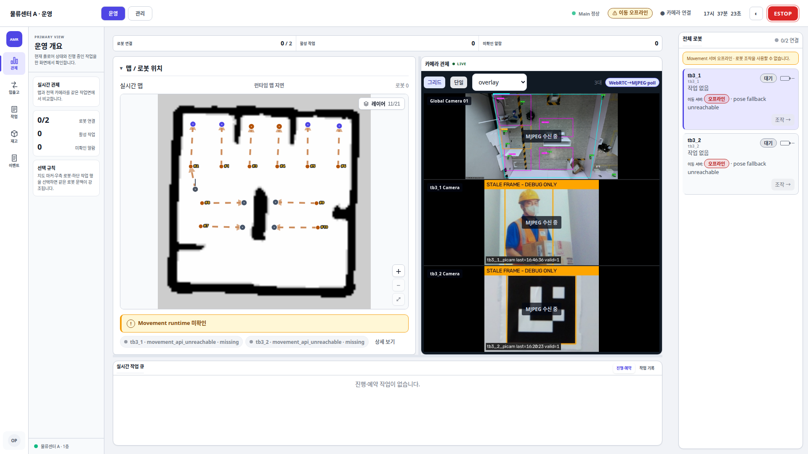 | 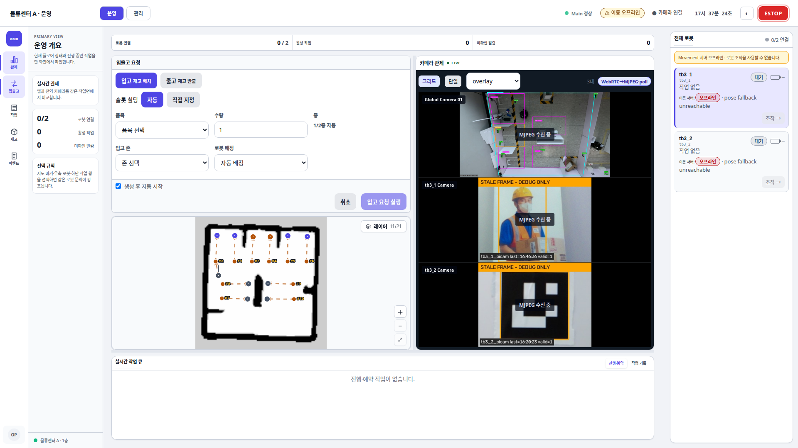 |

| 관리 — 맵·구역 | 관리 — 창고(품목·슬롯·재고) |
| --- | --- |
| 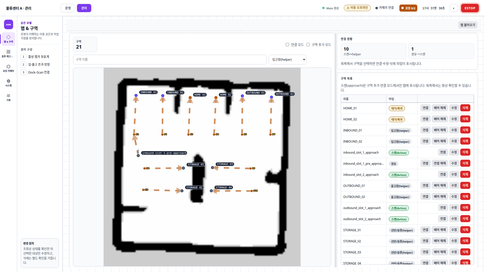 | 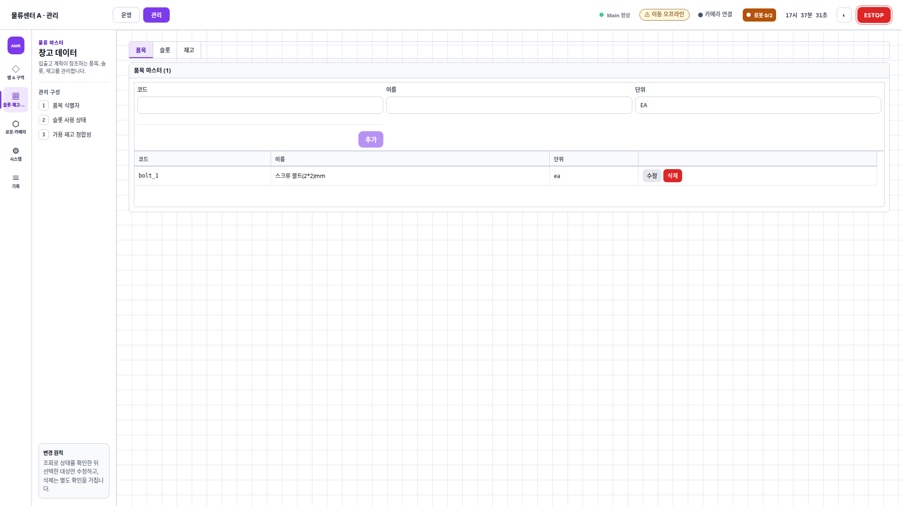 |

| 운영 — 작업 | 운영 — 재고 |
| --- | --- |
| 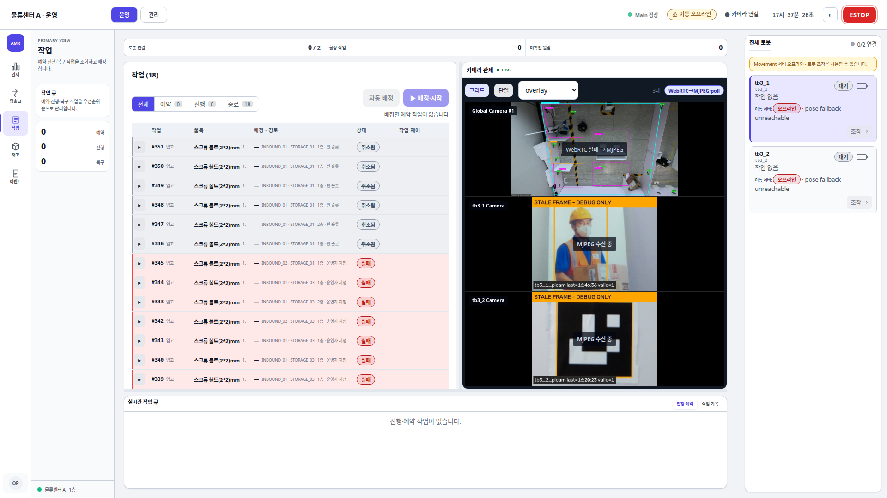 | 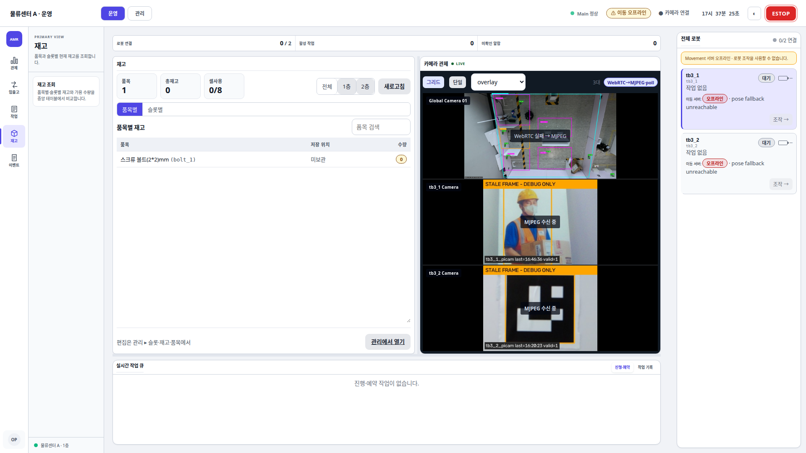 |

| 운영 — 이벤트 | 관리 — 전체 기록 |
| --- | --- |
| 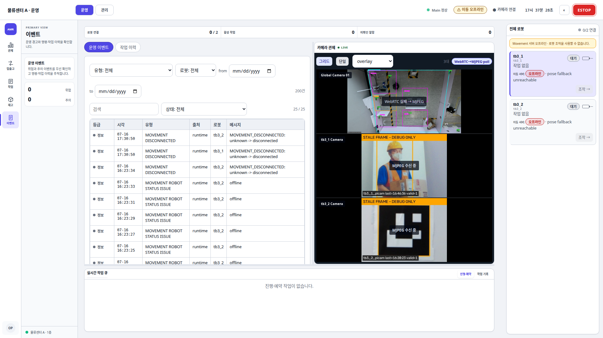 | 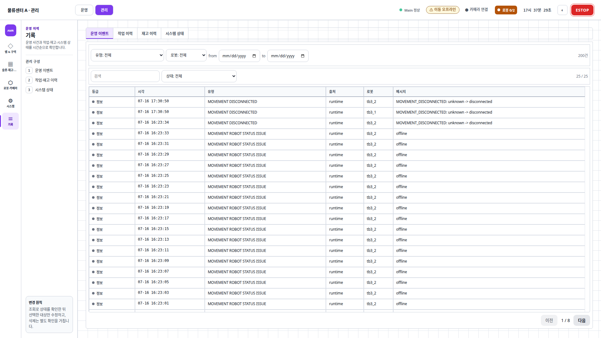 |

| 관리 — 로봇·카메라 | 관리 — 시스템 |
| --- | --- |
| 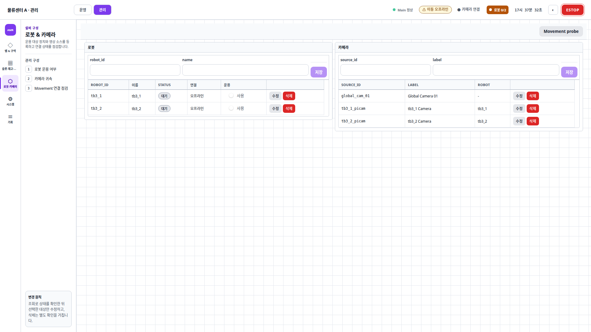 | 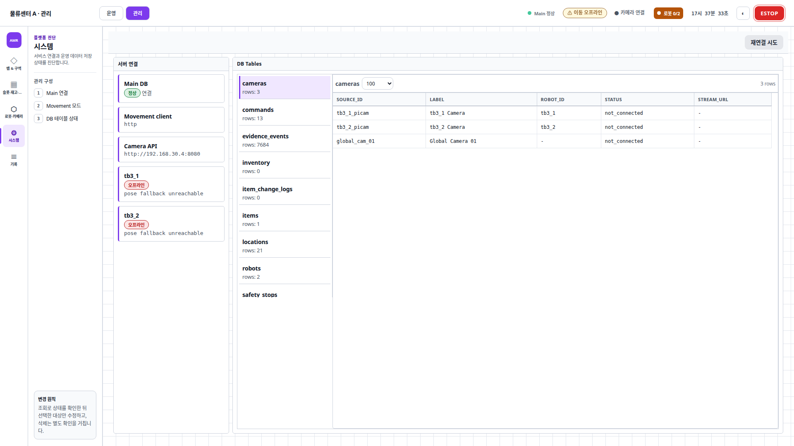 |

캡처 기준은 2026-07-16 17:37 KST에 최신 production build를 서빙한 Main 서버의 데스크톱 라이트 테마다.
외부 서버의 연결·데이터 상태는 촬영 시점의 실제 상태를 그대로 표시한다.

## 2. 계층 구분

화면은 **프론트스테이지**와 **백스테이지**를 구분한다. 사용자가 직접 조작하는 버튼과 입력만 프론트스테이지에 두고, 서버의 검증·계획·배정 과정은 필요한 결과만 보여준다. 예를 들어 운영자는 입고를 실행하지만 슬롯 선택과 로봇 작업 단계 계산 과정까지 다루지 않는다.

## 3. 페르소나 (요약)

| | 운영자 (P1) | 관리자 (P2) |
| --- | --- | --- |
| 목표 | 입출고 지시·진행 확인·문제 개입 | 맵·슬롯·품목·디바이스 정의 |
| 고충 | 기술 개념 강요·실패 원인 불명 | 정의 화면 분산 |
| 핵심 화면 | 관제·입출고·작업·수동 조작 | 맵&구역·창고·디바이스·시스템 |
| 안 보는 것 | 좌표·스텝·DB | — (운영 화면 + 정의) |

## 4. 하는 일 (요약)

**운영자**는 로봇 위치와 상태를 확인하고 입출고를 지시한다(`POST /work-orders`). 진행 중에는 실패 원인을 확인하고, 필요하면 수동 이동과 예약 순서 조정으로 개입한다.

**관리자**는 맵과 구역 마커, 보관 슬롯, 품목, 재고, 로봇·카메라 디바이스를 정의한다. 로봇의 `운용 사용` 토글은 작업 투입 의도이며 오프라인이 되어도 자동으로 OFF되지 않는다.

## 5. 핵심 플로우

### F1 입고 happy path

운영자는 입출고 화면에서 품목과 수량을 넣고 [실행]만 누른다. 백스테이지에서 서버가 슬롯을 검증하고, 로봇 작업 단계를 합성하고, 로봇을 배정해 mission을 시작하며, 완료되면 재고에 반영한다.

### F2 출고 재고 부족

재고가 모자라면 서버가 `409 insufficient_inventory`로 거부하고, 화면에는 배너와 [재고 보기] 버튼이 뜬다. 운영자는 수량을 조정해 재시도한다. 실패가 조용히 사라지는 일은 없다.

### F3 수동 개입

맵에서 지점 클릭 이동(Goto)이나 Teleop 조작을 하면 Main이 Movement로 라우팅한다. ESTOP 로봇은 teleop·goto·
신규 배정에서 제외된다. 모든 운용 로봇이 ESTOP이면 입출고 폼 전체를 차단하고, 일부 로봇만 ESTOP이면 정상
로봇은 계속 운영한다.

### F4 관리자 창고 셋업

맵 등록 → 구역 마커 → 슬롯 → 품목·재고 순서로 정의한다. 필수 구역(inbound/outbound/home)이 빠지면 검증에서 걸린다. 이 셋업이 끝나야 F1·F2가 동작한다.

## 6. IA · 모드

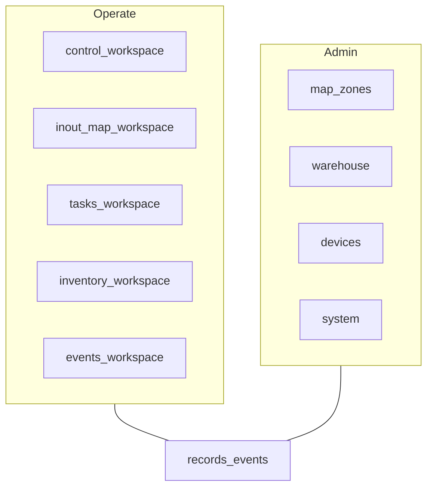

### 운영 셸

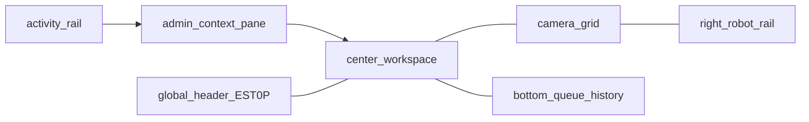

- 운영은 활동 레일과 중앙 문맥·작업면을 사용하고, 관리 셸은 활동 레일 + 문맥 패널을 사용한다. 관제는 맵·카메라·로봇 레일을 유지하고, 작업·재고·이벤트는 중앙 작업면을 교체한다.
- 입출고는 데스크톱에서 요청 폼과 참조 맵을 같은 작업면 안에 세로로 배치한다. 폼이 맵을 덮지 않으며 존·슬롯 선택은 맵 마커 강조와 동기화한다. 좁은 화면에서는 모달 드로어와 스크롤 구조로 전환한다.
- 재고는 품목별·슬롯별 탭으로 나뉜다. 품목별에는 저장 장소를 표시하고, 슬롯별 행 선택 시 참조 맵의 슬롯 마커를 강조한다.
- 카메라는 WebRTC 첫 프레임 확인 후 전환하고, 연결 실패·손실 시 MJPEG를 유지한다. MJPEG 사용 중에는 5·15·30·60초 간격으로 WebRTC를 다시 확인해 정상화되면 자동 복귀한다.
- ESTOP은 헤더 상시(모드 무관). 누름=즉시, 해제=확인. 복구 패널은 관제 셸에 상시.
- 수동 조작·맵 이동은 선택 로봇 문맥을 보존하는 보조 드로어다. 좁은 화면의 드로어는 스크림·focus 순환·배경 차단을 갖춘 모달이다.
- 좌측 메뉴는 아이콘과 문자를 함께 표시하고 현재 항목을 명시한다. 작업 배지는 진행 중 건수만 표시하며 미확인 계약이 없는 기록에는 배지를 표시하지 않는다.
- 하단에는 관제 화면의 실시간 작업 큐와 작업 기록 타임라인을 유지한다. 상세 작업 편집은 `/operate/tasks` 중앙 작업면에서 수행한다.
- 이전 `?panel=tasks|inventory|records` URL은 각각 `/operate/tasks|inventory|events`로 정규화하고, `?panel=control`은 수동 조작 드로어로 정규화한다.
- 알람 KPI는 미확인 위험·주의 event만 집계한다. 패널에서 현재 snapshot의 알람을 모두 확인할 수 있으며 확인 키는 브라우저 `localStorage`에 저장한다. 이는 화면 강조를 해제하는 로컬 확인 상태이며 서버 event를 변경하거나 위험 경보 정책을 억제하지 않는다.
- `/operate/tasks`·`/operate/inventory`·`/operate/events`가 현재 canonical 목적지다.

## 7. 라우트

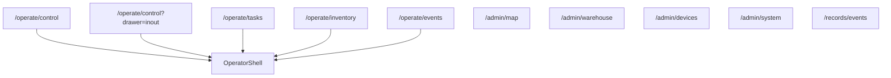

| Route | 컴포넌트 | 메뉴 |
| --- | --- | --- |
| `/operate/control` | `OperatorShell` 관제 | 운영 |
| `/operate/control?drawer=inout` | 입출고 폼 + 참조 맵(좁은 화면은 드로어) | 운영 |
| `/operate/tasks` | 예약·진행·복구 작업 중앙 작업면 | 운영 |
| `/operate/inventory` | 품목별·슬롯별 재고 중앙 작업면 | 운영 |
| `/operate/events` | 운영 이벤트·작업 이력 중앙 작업면 | 운영 |
| `/operate/control?drawer=control` | 수동 조작·맵 이동 보조 드로어 | 운영 |
| `/admin/map` | `MapEditor` 맵&구역 | 관리 |
| `/admin/warehouse` | `WarehouseAdmin` 품목·슬롯·재고 | 관리 |
| `/admin/devices` | 로봇·카메라·통신 상태 | 관리 |
| `/admin/system` | 서버 연결 + DB 탐색 | 관리 |
| `/records/events` | 운영 이벤트·작업 이력·재고 이력·시스템 상태 4탭 | 관리 |

`admin/scenario`·`admin/actions`는 메뉴에 없으며 미등록 URL은 기본 운영 화면으로 이동한다.

## 8. 노출 정책

원칙: 운영 메뉴는 완료 기능만. 부분 구현은 상단에 범위 표시. 진단은 관리/dev. registry ≠ 메뉴 전부.

| Route | 메뉴 | 정책 |
| --- | --- | --- |
| `/operate/control` | 운영 | 관제 · ESTOP 복구 패널 |
| `/operate/control?drawer=inout` | 운영 | work order — 검증·에러·결과 완료 |
| `/operate/tasks` | 운영 | 예약/진행/복구 grouping · 우선순위 영속화 |
| `/operate/inventory` | 운영 | 품목별 저장 장소 · 슬롯별 맵 연동 |
| `/operate/events` | 운영 | 운영 이벤트 · 작업 이력 |
| `/admin/map` | 관리 | waypoint CRUD·스캔 연결 |
| `/admin/warehouse` | 관리 | 품목/슬롯/재고 — **구현됨** |
| `/admin/devices` | 관리 | 디바이스·통신 상태 |
| `/admin/system` | 관리 | 연결 + DB 탐색 |
| `/records/events` | 공유 | projection read-only (`records` 테이블 없음) |

메뉴에는 운영·관리 업무 화면만 노출한다. DB 원본과 연결 probe는 관리 화면 내부 진단 기능으로 둔다.

기록의 `작업 이력`은 내부 전환으로 작업 결과와 이동 명령을 나눈다. `시스템 상태`는 Movement·Vision·
Camera 필터, 연결 최초 상태·끊김·복구 사건, 인증 오류 반복 횟수와 고빈도 폴링 성공률·평균 응답 시간을
보여준다. HTTP 숫자는 원본 title로만 보존하고 표에는 운영자가 이해할 수 있는 평문 결과를 표시한다.

## 9. 상태 표현 원칙

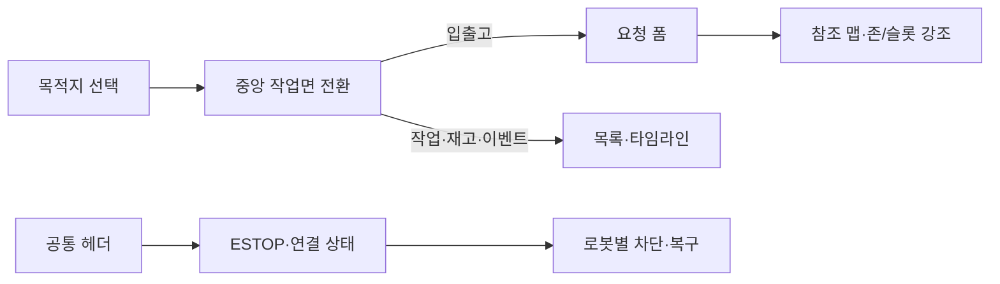

- 정상 상태는 저채도, 즉시 조치가 필요한 위험만 빨강, 확인이 필요한 상태는 노랑으로 표시한다.
- 색상만으로 상태를 구분하지 않고 문구·아이콘·비활성화 이유를 함께 제공한다.
- ESTOP은 모든 화면의 헤더에 고정하고, 해제는 확인 절차를 거친다.
- ESTOP 상태는 로봇별 `stop_requested|stop_confirmed|stop_unconfirmed|clear_requested|clear_confirmed|clear_unconfirmed|clear`로 유지한다. 단순 통신 끊김은 ESTOP 미확인으로 표시하지 않는다.
- 정지/해제 미확인 로봇만 격리하고 다른 로봇의 운영은 계속한다. 해제 미확인 표시는 확인 후 재시도 동작을 제공한다.
- 삭제·안전 중단·ESTOP은 영향이 다르므로 같은 버튼 표현을 사용하지 않는다.
- 작업 생성은 접수·배정 대기·Movement 실행 시작·시작 실패를 구분하고, 안전 중단은 전송 중·전달됨·정지 확인 후 복구 전환·실패를 즉시 표시한다. 요청 접수와 물리 동작 완료를 같은 성공 문구로 표현하지 않는다.
- Movement 오프라인과 맵 불일치처럼 조작할 수 없는 이유를 해당 조작 영역에서 한 번만 설명한다.
- 서버 오류 코드는 운영자가 다음 행동을 판단할 수 있는 문장으로 변환한다.

상태별 버튼 기준, 알람 등급과 자동화 범위는 [TEST_CASES](TEST_CASES.md)가 단일 정본이다.

## 10. 접근성 · 화면 환경

| 항목 | 현재 기준 | 검증 경계 |
| --- | --- | --- |
| 상태 인지 | 색상 외 문구·아이콘·비활성화 이유를 함께 제공 | 위험/주의/정보 상태를 Playwright와 수동 확인 |
| 키보드 | 기본 HTML 조작 순서와 focus 표시를 유지하고 좁은 화면 모달은 focus를 내부에 순환시킨다 | 드로어 focus·ESC·복원은 Playwright, 전체 화면 keyboard-only는 수동 확인 |
| 이름·설명 | 아이콘 단독 조작은 접근 가능한 이름, 입력은 label, 오류는 다음 행동을 제공 | 스크린리더 인수는 아직 미검증 |
| 대비·확대 | 위험색 남용을 피하고 본문·버튼 가독성을 유지 | WCAG 대비 측정과 200% 확대 시험은 릴리스 전 수동 확인 |
| 화면 환경 | 관제 데스크톱을 우선하고 좁은 화면에서는 적층·모달로 전환 | 모바일 전체 운영은 제한적 |

안전 조작은 접근성 편의와 별개로 즉시성·오조작 방지를 함께 만족해야 한다. ESTOP 활성은 즉시 실행하고,
해제·복구·삭제처럼 되돌리기 어렵거나 현장 확인이 필요한 동작은 명시적 확인과 결과 피드백을 제공한다.
접근성 자동화가 아직 전체 적합성을 의미하지 않으므로 미검증 항목을 숨기지 않는다.

## 관련

- [TEST_CASES](TEST_CASES.md) · [ARCHITECTURE](ARCHITECTURE.md) · [API](API.md) · [OPERATIONS](OPERATIONS.md)
