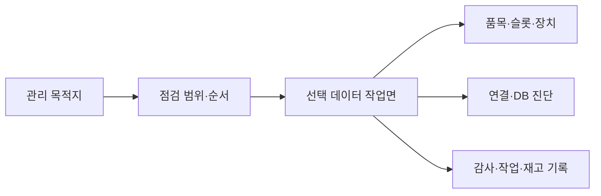

# Admin Workspace Information Architecture

상태: Active
주 독자: Frontend 개발자·관리 화면 기획자
보조 독자: QA
난이도: 개발
소유: Frontend
최종 갱신: 2026-07-16 16:00 KST
구현 기준: AdminShell과 관리 route 컴포넌트
목적: 관리 작업면의 정보 구조와 행동 배치 원칙을 정의한다.

관리 화면은 운영 중 자주 보는 상태가 아니라 시스템 구성을 변경하고 진단하는 작업면이다. 운영 셸과 같은 공간적 인과 원칙을 따르되, 중앙에는 실제 편집 대상만 둔다.

## 화면 구성

| 목적지 | 관리 대상 | 주요 확인 | 주요 행동 |
|---|---|---|---|
| 맵 & 구역 | 활성 맵, 좌표계, waypoint, Dock–Scan pair | 맵 일치, 존 유형·방향, 연결 누락 | 맵 가져오기, 구역 생성·수정, Scan 연결 |
| 창고 데이터 | 품목, 슬롯, 재고 | 식별자, 슬롯 사용 여부, 가용 수량 | 품목·슬롯 upsert, 재고 조정 |
| 로봇 & 카메라 | 로봇, 카메라 소스, 통신 로그, Goto | 운용 여부, 카메라 귀속, Movement 응답 | 장치 저장·삭제, probe, Goto 진단 |
| 시스템 | Main, Movement, Camera, DB | 연결 모드, worker/DB 상태, 테이블 데이터 | 재연결, DB 테이블·행 조회 |
| 기록 | 이벤트, 작업, 이동 증거, 재고 변경 | 위험도, 발생 시각, 대상, 변경 근거 | 필터, 검색, 감사 추적 |

## 배치 계약

1. Activity Rail은 관리 목적지만 소유한다.
2. 문맥 Pane은 선택 화면의 구성 목록과 변경 원칙을 소유한다.
3. 중앙 워크벤치는 저장·삭제·probe처럼 대상에 직접 작용하는 명령만 소유한다.
4. 좌측에 이미 표시한 화면 설명은 중앙 상단에서 반복하지 않는다. 중앙 상단에는 페이지 고유 행동만 남긴다.
5. 전역 연결 상태와 E-STOP은 운영·관리 모두 앱 헤더에 유지한다.
6. 위험 이벤트는 적색, 주의는 호박색, 정보는 중립색을 사용하고 텍스트 등급을 반드시 병기한다.

## 운영 워크벤치 연계

- 맵과 카메라 사이 가로 거터는 두 관제 면적 비율을 저장한다.
- 카메라 Grid는 전역 및 로봇 귀속 소스를 모두 표시하고 각 타일 좌상단에 카메라 이름을 표시한다.
- 관제 하단은 실시간 작업 큐와 작업 기록 타임라인을 유지한다. 작업 행은 핵심 상태와 행동을 우선하고,
  중복 상세정보는 펼침 영역에서 반복하지 않는다.
- 작업·재고·이벤트 목적지는 중앙 작업면으로 전환한다. 입출고는 데스크톱에서 폼과 참조 맵을 세로로
  분할하고, 좁은 화면에서는 모달 드로어로 전환한다.
