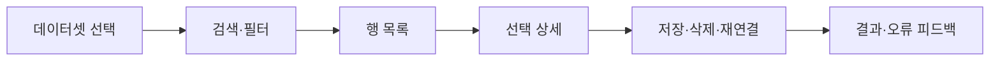

# 관리자 워크스페이스 정책

상태: Active
주 독자: Frontend 개발자·관리 화면 기획자
보조 독자: QA
난이도: 개발
소유: Frontend
최종 갱신: 2026-07-18 14:55 KST
구현 기준: AdminShell과 관리 route·데이터 표·필터·탭 컴포넌트
목적: 관리 작업면의 정보 구조와 표·탐색·행동 배치 기준을 한 곳에서 정의한다.

관리 화면은 대시보드가 아니라 품목·슬롯·장치·DB·감사 기록을 빠르게 조회하고 수정하는 데이터 워크스페이스다.

## 목차

- [정보 구조](#1-정보-구조)
- [레이아웃 원칙](#2-레이아웃-원칙)
- [표와 기록](#3-표와-기록-규격)
- [시각 규격](#4-시각-규격)
- [화면별 적용](#5-화면별-적용-기준)
- [검수 기준](#6-검수-기준)

## 1. 정보 구조

| 목적지 | 관리 대상 | 주요 확인 | 주요 행동 |
| --- | --- | --- | --- |
| 맵 & 구역 | 활성 맵, waypoint, Dock–Scan pair | 맵 일치, 구역 유형·방향, 연결 누락 | 맵 가져오기, 구역·Scan 연결 변경 |
| 창고 데이터 | 품목, 슬롯, 재고 | 식별자, 슬롯 사용 여부, 가용 수량 | 품목·슬롯 저장, 재고 조정 |
| 로봇 & 카메라 | 로봇, 카메라, 통신 로그, Goto | 운용 여부, 카메라 귀속, Movement 응답 | 장치 저장·삭제, probe, Goto 진단 |
| 시스템 | Main, Movement, Camera, DB | 연결 모드, worker·DB 상태 | 재연결, DB 테이블·행 조회 |
| 기록 | 이벤트, Task, 이동 증거, 재고 변경 | 위험도, 시각, 대상, 변경 근거 | 필터, 검색, 감사 추적 |

전역 연결 상태와 ESTOP은 운영·관리 모두 앱 헤더가 소유하며 관리 작업면에서 중복 표시하지 않는다.

## 2. 레이아웃 원칙

1. 화면 셸은 고정하고 데이터 영역만 스크롤한다. 페이지 스크롤과 표 스크롤을 중첩하지 않는다.
2. 좌측 Activity Rail은 관리 목적지, Context Pane은 현재 화면의 범위와 점검 순서만 설명한다.
3. 상단에는 현재 작업에 필요한 탭·검색·필터·저장 동작만 둔다. 같은 제목과 설명을 본문에 반복하지 않는다.
4. 목록–상세 관계는 좌우로 배치한다. DB 탐색은 좌측 테이블 목록, 우측 선택 테이블 행 구조를 기본으로 한다.
5. 독립 데이터셋은 탭으로 전환한다. 여러 대형 표를 세로로 쌓지 않는다.
6. 좁은 화면에서는 Context Pane을 숨기고 작업영역을 우선한다. 열을 임의로 잘라내지 않고 표 내부 스크롤을 제공한다.

## 3. 표와 기록 규격

- 헤더와 기본 행은 공통 compact density 토큰을 사용한다.
- 열 제목은 표 내부 세로 스크롤 중 고정한다.
- 텍스트는 한 줄 말줄임하고 원문 확인 수단(title 또는 상세 패널)을 유지한다.
- 식별자·시간·URL·DB 원문은 고정폭 글꼴을 사용한다.
- 데이터 열은 내용 기반 최소 너비를 유지하고, 남는 폭은 설명·메시지 열이 사용한다.
- 짝수 행 배경과 hover 강조는 약하게 적용하며 상태 의미보다 강하지 않게 한다.
- 위험·주의·정상은 색만 사용하지 않고 아이콘·라벨·테두리를 함께 사용한다.
- 필터와 페이지 이동은 고정하고 행 목록만 스크롤한다.
- 삭제·상태 변경은 선택한 행의 맥락 안에서 실행하며 별도 확인을 거친다.

## 4. 시각 규격

- 표와 도구막대는 공통 radius·border 토큰을 사용하고 장식용 그림자는 사용하지 않는다.
- 셀 경계와 정렬선으로 열 구조를 명확히 한다.
- Accent 색은 선택 탭, 활성 행, 포커스에만 사용한다.
- 배경 격자는 빈 작업영역에서만 보이며 실제 셀 경계와 경쟁하지 않는다.
- 입력과 버튼은 공통 control 토큰을 사용하며 저장·재연결 같은 명시적 동사 라벨을 사용한다.

## 5. 화면별 적용 기준

- 창고: 품목·슬롯·재고를 탭으로 분리하고 선택한 데이터셋을 최대화한다.
- 장치: 로봇·카메라는 동일한 마스터 데이터 규격, 통신 로그는 별도 진단 영역으로 취급한다.
- 시스템: 연결 상태는 좁은 요약 열, DB는 테이블 인덱스와 행 그리드 구조로 배치한다.
- 기록: 감사·작업·이동·재고 변경을 탭으로 분리하고 필터–행–페이지 순서를 유지한다.
- 맵: 도구막대는 고정하고 맵–속성 패널 분할 영역이 남은 높이를 사용한다.

## 6. 검수 기준

- 중앙에는 선택 데이터와 그 데이터에 직접 작용하는 명령만 있는가?
- Context Pane의 설명을 중앙 제목과 본문에서 반복하지 않는가?
- 표 헤더·필터·페이지 이동은 고정되고 행 영역만 스크롤하는가?
- 삭제·상태 변경은 선택 대상 가까이에 있으며 확인 절차가 있는가?
- 좁은 화면에서도 열을 삭제하지 않고 내부 스크롤로 원문에 접근할 수 있는가?

## 관련

- [공통 UI 정책](DESIGN_SYSTEM.md)
- [공개 UX 정본](../../../docs/UX.md)
