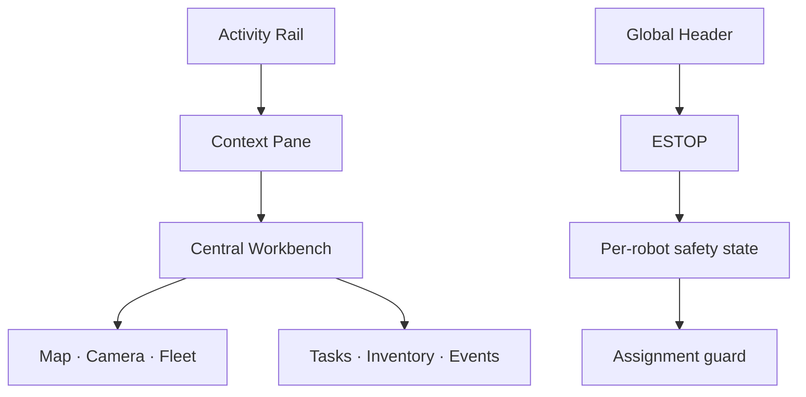

# AMR Control UI Policy

상태: Active
주 독자: Frontend 개발자
보조 독자: 제품 기획자·QA
난이도: 개발
소유: Frontend
최종 갱신: 2026-07-16 16:00 KST
구현 기준: 현재 공통 CSS 토큰·Layout·OperatorShell·AdminShell
목적: 운영·관리 화면의 시각 언어와 상호작용 규칙을 정의한다.

이 문서는 운영·관리 화면의 시각 언어와 상호작용 규칙을 정의한다. 새 화면과 기존 화면 개편은 이 문서를 기본 계약으로 사용한다.

## 1. UX 원칙

1. **관제 맥락 보존**: 입출고·수동 조작 중에는 지도와 활성 작업을 유지하고, 모든 운영 목적지에서 전역 카메라·연결 상태·E-STOP을 유지한다.
2. **공간적 인과 일치**: 좌측 Activity 버튼은 바로 옆 Primary Pane과 중앙 목적지를, 우측 로봇·페이지 명령은 우측 Secondary Pane을 바꾼다. 하단 Fleet Bar는 로봇 선택과 작업 안전 중지를 소유한다.
3. **예외 우선 강조**: 정상 상태는 중립색으로 표시하고 주의·위험·실행 중 상태에만 의미색을 사용한다.
4. **목적지·명령·선택 분리**: 관제·작업·재고·이벤트는 목적지, 입출고·수동 조작은 명령, 지도 마커·활성 작업·로봇 선택기는 선택 제어로 분류한다.
5. **한 화면 한 기본 행동**: 각 패널의 기본 행동은 하나만 채움 버튼으로 표현하고 보조 행동은 외곽선 또는 텍스트 버튼을 사용한다.
6. **색 단독 전달 금지**: 모든 상태색에는 텍스트, 아이콘, 패턴 중 하나를 함께 제공한다.

## 2. 운영 화면 정보 계층

```text
┌──────┬──────────────┬───────────────────────────────────┬──────────────┐
│활동바│좌측 문맥 Pane│ 전역 상태 · 연결 · 시간 · E-STOP │ 우측 로봇 Pane│
├──────┼──────────────┼─────────────────────┬─────────────┼──────────────┤
│관제  │관제 요약     │ 실시간 맵            │전역 카메라  │전체 로봇 상태 │
│작업  │작업 수·규칙  │                     │             │로봇별 조작 → │
│재고  │재고 조회 문맥│ 중앙 목적지 화면     │상시 영상    │예외 우선 정렬 │
│이벤트│알람 수·규칙  ├─────────────────────┴─────────────┤              │
│관리  │              │ 로봇별 작업 · 단계 타임라인 · 안전 중지        │
└──────┴──────────────┴───────────────────────────────────┴──────────────┘
```

### 상시 영역

- 전역 헤더: Main/Movement/Camera 연결, 로봇 연결 수, 시각, 테마, E-STOP
- 중요 알람: 미확인 위험·주의 이벤트 한 건과 전체 건수
- 실시간 지도: 전역 카메라와 같은 높이로 나란히 배치하고 Pose 최신성, 로봇 위치, 경로, 구역, 목적지 지정 유지
- 전역 카메라: 로봇 귀속이 없는 카메라, 전송 방식, 원본/오버레이
- Fleet mission bar: 모든 로봇의 실행 작업, Movement 단계 진행, Work Order 안전 중지를 하단에 상시 유지

### 문맥 영역

- 우측은 모든 로봇의 압축 상태를 동시에 표시하고 선택 로봇을 테두리와 배경으로 강조한다.
- 지도 마커, 우측 로봇 카드, 하단 Fleet 행은 동일한 로봇 선택 상태를 갱신한다. 우측 로봇 카드는 선택과 함께 해당 로봇의 큰 카메라 문맥을 연다.
- 하단 기본 탭은 진행·예약 Work Order만 표시하고 완료·실패·중단은 작업 기록 탭으로 분리한다. 진행 중 행은 LIVE 텍스트, 상태 바, 저채도 배경을 함께 사용한다.
- Goto 목표는 초안과 이동 중을 구분한다. 명령 수락 후 드로어를 닫아도 임시 목표를 유지하고 도착·실패·취소 terminal 상태 또는 명시적 정지에서 제거한다.
- 기본: 선택 로봇 상태, 배터리, 현재 작업, 개별 카메라
- 입출고: 페이지 헤더의 명령으로 열고 유형, 품목, 수량, 존, 슬롯, 로봇 배정, 실행 전 검증을 제공한다.
- 조작: 선택 로봇 Inspector에서 열고 Teleop, 맵 목적지 이동, Movement 차단 사유를 제공한다.

### 조회·관리 영역

- 중앙 목적지 워크스페이스: 작업, 재고, 이벤트. 좌측 메뉴 선택 시 해당 중앙 화면으로 전환
- 관리 모드: 맵·구역, 품목·슬롯·재고, 로봇·카메라, 시스템·DB
- 관리 모드는 Activity Rail + 문맥 Pane + 중앙 워크벤치를 사용한다. 운영은 Activity Rail과 관제 문맥·작업면을 사용한다. 좌측 목적지를 누르면 인접 문맥 설명과 중앙 화면이 함께 바뀐다.
- 문맥 Pane은 반드시 확인할 대상과 변경 원칙만 제공하며, 저장·삭제·probe 같은 명령은 중앙 워크벤치의 대상 가까이에 둔다.
- 관리 헤더는 워크벤치 상단에 고정하고 기존 전역 연결 상태와 E-STOP은 앱 헤더에 유지한다.

## 3. 디자인 토큰

### 색상

| 용도 | 토큰 | 라이트 값 | 규칙 |
|---|---|---:|---|
| 앱 배경 | `--bg` | `#f4f6f8` | 콘텐츠 캔버스 |
| 기본 표면 | `--surface` | `#ffffff` | 패널·입력 |
| 보조 표면 | `--surface-2` | `#f8fafc` | 행·도구막대 |
| 본문 | `--text` | `#172033` | 핵심 정보 |
| 보조 본문 | `--text-muted` | `#667085` | 설명·메타 |
| 테두리 | `--border` | `#d9e0e8` | 공통 토큰 |
| 운영 강조 | `--operator` | `#315fe9` | 선택·기본 행동 |
| 정상 | `--ok-*` | 녹색 계열 | 연결점과 정상 확인에만 사용 |
| 주의 | `--warn-*` | 호박 계열 | 지연·확인 필요 |
| 위험 | `--err-*` | 적색 계열 | E-STOP·실패·파괴 행동 |

정상 패널 전체를 녹색으로 칠하지 않는다. 상태색 배경은 저채도 의미 토큰만 사용한다.

### 상태 색상 정책

운영·관리 모드는 아래 의미 분류와 `--status-<tone>-*` 토큰을 공동 사용한다. 원시 상태 코드는 `statusTone()`에서 단일 분류하며 임의 화면에서 별도 색을 지정하지 않는다.

| 의미 | 대표 상태 | 색상·클래스 | 비색상 단서 |
|---|---|---|---|
| 완료·정상 | `DONE`, `COMPLETED`, `OK`, `ONLINE` | 초록 · `status-success` | 완료·정상 문구 |
| 진행 | `RUNNING`, `MOVING`, `IN_PROGRESS`, `RECOVERY_RUNNING` | 파랑 · `status-progress` | 실행 중·이동 중 문구 |
| 대기 | `CREATED`, `QUEUED`, `ASSIGNED`, `IDLE`, `PENDING` | 중립 회색 · `status-waiting` | 대기·할당 문구 |
| 주의 | `STALE`, `DEGRADED`, `AWAITING_OPERATOR`, `RECOVERY_REQUIRED` | 노랑 · `status-warning` | 주의·확인 필요 문구 |
| 실패·위험 | `FAILED`, `ERROR`, `ESTOP`, `OFFLINE`, `REJECTED` | 빨강 · `status-danger` | 실패·비상 정지 문구 |
| 취소·중단 | `CANCELLED`, `STOPPED`, `DISABLED` | 중립 회색 · `status-cancelled` | 취소 문구와 취소선 |

색상만으로 상태를 전달하지 않으며 모든 상태 요소는 한글 라벨을 함께 표시한다.

### 간격·크기

- 간격·여백·제어 높이는 공통 CSS 토큰을 사용하며 화면별 임의 값을 만들지 않는다.
- 데스크톱에서는 Activity Rail·Context Pane·중앙 작업면·Fleet Pane을 함께 유지하고, 좁은 화면에서는 문맥을 접어 작업면을 우선한다.
- 전역 카메라는 맵과 같은 관제 문맥에서 유지하고, 공간이 부족하면 세로로 적층한다.

### 모서리·테두리·그림자

- 소형 요소·입력·버튼·패널은 공통 radius 토큰을 사용한다.
- 기본 테두리와 선택 강조는 공통 토큰으로 관리하며 개별 화면에서 수치를 재정의하지 않는다.
- 그림자는 계층 분리가 필요한 팝오버·드로어에만 사용하고 기본 패널은 테두리 중심으로 구분한다.

### 타이포그래피

- UI: system-ui, Pretendard, Noto Sans KR 순서
- 제목·본문·메타는 공통 typography 토큰을 사용한다. ID·좌표·시각·퍼센트는 mono 토큰을 사용한다.
- 영문 대문자 라벨은 보조 정보에만 사용한다.

## 4. 컴포넌트 규격

### 버튼

- Primary: 현재 패널의 단일 완료 행동
- Secondary: 취소·새로고침·보기 전환
- Ghost: 접기·확대·세부 이동
- Danger: E-STOP·안전 중단·삭제
- 비활성 버튼은 사유 텍스트 또는 툴팁을 함께 제공한다.

### 패널

- 헤더는 공통 헤더 토큰을 사용하며 제목은 왼쪽, 상태·필터는 오른쪽에 둔다
- 패널 내부 스크롤은 헤더와 주요 실행 버튼을 고정한 뒤 본문에만 적용한다.
- 패널을 여는 트리거와 결과 패널은 같은 축에 배치한다. 좌측 목적지는 중앙, 페이지 명령과 선택 대상 명령은 우측 문맥에서만 반응한다.
- KPI는 읽기 전용이다. 작업·이벤트 이동은 좌측 목적지 또는 현재 경고의 명시적 명령으로 제공한다.
- 새 패널을 지도 위에 삽입해 지도를 아래로 밀어내지 않는다.

### 알람

- 위험: 적색 강조 + 명시적 위험 텍스트
- 주의: 호박 강조 + 확인 필요 텍스트
- 정보: 중립 배경, 별도 강조 테두리 없음
- 확인한 알람은 목록에서 제거하지 않고 강조만 낮춘다.

### 카메라

- 전역 카메라는 관제 화면에서 항상 렌더링한다.
- 로봇 카메라는 선택 로봇 문맥에서 제공한다.
- WebRTC 우선, MJPEG fallback 상태를 텍스트 배지로 표시한다.
- 영상이 없을 때 검은 빈 박스를 유지하지 않고 오프라인 사유와 재시도를 표시한다.

### 표와 폼

- 표 헤더는 고정하고 상태 열과 행동 열의 위치를 화면 간 통일한다.
- 입력 라벨은 항상 노출하며 placeholder를 라벨 대신 사용하지 않는다.
- 긴 폼은 단계 번호와 섹션 제목으로 나누고 실행 버튼은 하단에 고정한다.

## 5. 반응형·접근성

- 데스크톱: 관리 문맥 Pane과 관제 맵·카메라·Fleet Pane을 함께 유지
- 좁은 화면: 문맥 Pane을 접고 관제 맵과 전역 카메라를 우선 유지
- 모바일: 중앙 목적지와 전역 카메라를 세로 적층하고 드로어를 모달로 전환
- 모든 조작은 키보드 접근 가능해야 하며 `:focus-visible` 외곽선을 제거하지 않는다.
- 모달은 focus trap, Escape 닫기, 트리거 focus 복귀를 제공한다.
- 최소 텍스트 대비는 WCAG AA를 목표로 한다.

## 6. 변경 체크리스트

- [x] 입출고·조작 중 지도와 활성 작업이 유지되고 모든 운영 목적지에서 전역 카메라·E-STOP이 유지되는가
- [x] 좌측 Activity는 좌측 Pane/중앙을, 우측 명령은 우측 Pane을 변경하는가
- [x] 정상 상태에 과도한 의미색을 쓰지 않았는가
- [x] 로딩·빈 상태·오류·비활성 사유가 있는가
- [x] 데스크톱·좁은 화면·모바일에서 핵심 기능을 사용할 수 있는가
- [x] 키보드 포커스와 ARIA 이름이 유지되는가
- [x] TypeScript, lint, Playwright 핵심 UX 테스트를 통과하는가

## 7. 현재 목적지와 안전 상태



- `/operate/control`: 관제 맵·카메라·로봇·하단 실시간 큐/기록
- `/operate/tasks`: 예약·진행·복구 작업 중앙 작업면
- `/operate/inventory`: 품목별 저장 장소와 슬롯별 맵 강조
- `/operate/events`: 운영 이벤트와 작업 이력
- `/records/events`: 운영 이벤트·작업 이력·재고 이력·시스템 상태
- ESTOP은 로봇별 요청·확인·미확인·해제 수명주기를 표시하고, 단순 offline과 분리한다.
