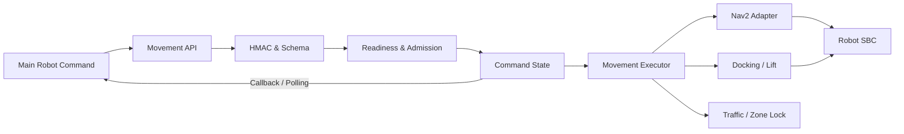

# Nav Server

Main Server의 원자 명령을 Nav2·ArUco·리프트 동작으로 실행하고 로봇 상태와 결과를 보고하는 이동 서버입니다.

## Implementation Overview



로봇별 Movement API 프로세스가 격리된 ROS domain을 사용합니다. 명령을 받으면 대상 로봇, 현지화, Nav2, 센서와 장치 readiness를 확인하고 traffic·zone 자원을 점유한 뒤 실행합니다. 종료 상태와 pose는 polling과 서명된 callback으로 Main에 전달합니다.

## Main Components

| Component | Primary code | 구현 역할 |
| --- | --- | --- |
| Command API | `nav_app/routers/robot_commands.py`, `nav_app/routers/movement_api.py` | 명령 접수·조회·취소 |
| Command State | `nav_app/services/command_state.py` | 활성 명령과 종료 상태 관리 |
| Planner & Executor | `nav_app/services/robot_commands.py`, `nav_app/services/movement_executor.py` | 명령 step 변환과 실행 |
| Localization | `nav_app/services/localization.py`, `nav_app/services/scan_map_alignment.py` | pose·scan·TF 기반 admission |
| Docking & Lift | `nav_app/services/docking.py`, `nav_app/services/lift_backends.py` | ArUco 정렬, 삽입, 리프트, 후진 |
| Runtime | `scripts/sf_nav.sh`, `config/runtime_profiles/` | profile·resource·process 수명주기 |

## Directory Structure

```text
nav-server/
├── nav_app/              # Movement API와 실행·상태·안전 로직
├── scripts/              # runtime, ROS adapter, 현장 검증
├── config/               # 로봇, ROS domain, Nav2 profile
├── launch/               # ROS launch entrypoints
├── map/                  # 지도, waypoint, zone, traffic segment
├── tests/                # unit·contract·safety tests
└── docs/                 # 구현 참조, runbook, 책임 경계
```

## Interfaces

| Direction | 상대 시스템 | 인터페이스 | 목적 |
| --- | --- | --- | --- |
| Input | Main Server | HMAC Robot Command API | 원자 명령·취소·E-stop 수신 |
| Input | AI Server | latest ArUco detection API | 도킹용 marker 관측 수신 |
| Input | ROS·Robot SBC | pose·TF·scan·Nav2·lift telemetry | readiness와 물리 결과 확인 |
| Output | Main Server | polling·HMAC callback | 명령 상태·결과·pose 보고 |
| Output | Nav2 | goal·cancel | 경로 실행과 취소 |
| Output | Robot SBC | 저속 제어·lift command | 도킹과 화물 이송 실행 |

상세 endpoint와 상태 계약은 [인터페이스 문서](docs/reference/INTERFACES.md)에 있습니다.

## Configuration

| Variable or File | 필수 여부 | 용도 |
| --- | :---: | --- |
| `SF_NAV_PROFILE` | 선택 | runtime profile 선택 |
| `ROS_SETUP` | 필수 | ROS 2 `setup.bash` 경로 |
| `NAV_MAIN_HMAC_SECRET` | 필수 | Main 명령 검증과 callback 서명 |
| `ROBOTS_CONFIG_PATH` | 선택 | 로봇 설정 정본 경로 |
| `config/robots.json` | 필수 | robot ID, API port, ROS domain |
| `config/runtime_profiles/` | 필수 | 실행 component와 resource 소유권 |

secret은 저장소에 기록하지 않습니다. profile 우선순위는 [Runtime Reference](docs/reference/RUNTIME.md)를 따릅니다.

## Run

```bash
cd nav-server
./scripts/setup_nav_server_env.sh
./scripts/sf_nav.sh profiles
ROS_SETUP=/opt/ros/jazzy/setup.bash ./scripts/sf_nav.sh --profile tb1-live check
./scripts/sf_nav.sh --profile tb1-live up
./scripts/sf_nav.sh --profile tb1-live status
```

종료는 `./scripts/sf_nav.sh --profile tb1-live down`을 사용합니다.

## Test

```bash
cd nav-server
./scripts/check_all.sh
ROS_SETUP=/opt/ros/jazzy/setup.bash ./scripts/verify_gazebo_nav2_e2e.sh --check
```

## Responsibility

Nav Server는 수신한 원자 명령의 admission, 물리 실행과 결과를 소유합니다. 작업 순서·재고·업무 완료는 Main Server가, 영상 관측은 AI Server가 소유합니다. 결정별 경계는 [Nav Server Responsibility](docs/responsibility.md)에 정리되어 있습니다.

## Related Documentation

| 문서 | 내용 |
| --- | --- |
| [Nav Algorithm](docs/reference/NAV_ALGORITHM.md) | 경로·도킹·localization 구현 |
| [Interfaces](docs/reference/INTERFACES.md) | 명령, callback, 상태 계약 |
| [Runtime](docs/reference/RUNTIME.md) | profile과 실행 설정 |
| [Operations](docs/runbook/OPERATIONS.md) | 현장 실행과 실패 복구 |
| [E2E Contract](../docs/integration/e2e-contract.md) | 서버 간 통합 계약 |
