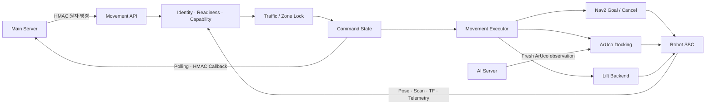

# Nav Server

Main Server의 원자 명령을 두 대의 TurtleBot3에서 Nav2 주행, ArUco 정밀 도킹,
Lift 적재·하역으로 실행하고 물리 결과를 보고하는 ROS 2 이동 서버입니다.

**담당 범위:** Command admission · Navigation · Docking · Lift · Traffic safety · Result reporting

<p align="center">
  <b>실제 로봇 기반 물류 이동·도킹 완결본</b><br>
  Nav2 이동 → ArUco 정렬 → Lift 작업 → 안전 복귀<br>
  <a href="../assets/e2e_final.mp4">▶ 3분 36초 완결본 MP4 재생</a>
</p>

## 최종 성과

`e2d-docing` 통합 시나리오에서 Nav Server가 담당한 이동·정밀 작업·안전 경로를
포함해 다음 결과를 기록했습니다.

| 검증 항목 | 결과 | 판정 범위 |
| --- | ---: | --- |
| 전체 E2E 시나리오 | `7/7 PASS` | 작업 생성부터 복귀·재고 반영까지 |
| Evidence gate | `2/2 PASS` | 적재·하역 전후 증거 연계 |
| 안전 정지·복구 | `2/2 PASS` | E-stop과 사람 감시 경로 |
| E2E 실행 시간 | `5분 25초` | 기록된 통합 실행 기준 |
| 로봇 격리 | R1 domain `2` / R2 domain `5` | API `:8001` / `:8002` |

이 수치는 루트 [통합 결과](../README.md#9-통합-결과와-검증)의 기록입니다.
자동 테스트와 Gazebo 결과는 API·상태·설정·Nav2 경로를 검증하지만 실제 마찰,
Lift 하중과 센서 오차까지 대신 증명하지는 않습니다.

## 시스템 구성



- Main Server는 업무 순서, 로봇 할당, 재고와 다음 단계를 소유합니다.
- Nav Server는 현재 명령을 수락할 수 있는지 판단하고 물리 실행 결과를 소유합니다.
- AI Server는 marker·객체 관측을 만들며, 관측을 조향에 적용하는 판단은 Nav가 담당합니다.
- Nav2는 global/local path와 goal 실행을 담당하고 Nav는 목적지와 실행 순서를 관리합니다.

### 실제 맵 제작

<p align="center">
  
</p>

<p align="center">
  <b>실제 운용 환경의 Navigation 맵 제작 화면</b><br>
  SLAM·RViz에서 작성하고 검토한 occupancy map과 <code>zones.json</code>을
  Nav2 경로 계획과 Gazebo 시나리오의 공통 입력으로 사용합니다.
</p>

## 명령 처리 흐름

```text
서명 검증
   ↓
robot identity · capability · readiness 확인
   ↓
traffic segment / zone lock 획득
   ↓
ACCEPTED → RUNNING
   ├── move_to_point ───────────────→ ARRIVED
   │                                      ↓ ARRIVED gate
   ├── dock_transfer / aruco_align ─→ DONE
   ├── leave_dock / manual_drive ───→ DONE
   └── cancel / estop ───────────────→ CANCELED / ABORTED
                                          └─ 정지 미확인: STOP_UNCONFIRMED
   ↓
소유 lock 해제 · 상태 저장 · callback
```

| 명령 | Nav 동작 | 정상 결과 |
| --- | --- | --- |
| `move_to_point` | waypoint 해석, traffic lock, Nav2 이동 | `ARRIVED` |
| `dock_transfer` | ArUco 정렬, 포크 삽입, Lift, 후진 | `DONE` |
| `aruco_align` | ArUco 정렬 또는 대기 위치 주차 | `DONE` |
| `leave_dock` | 주차 상태와 후방 여유 확인 후 이탈 | `DONE` |
| `manual_drive` | 제한 속도·시간의 저속 직접 제어 | `DONE` |
| `estop` | Nav2, base, Lift 정지 | `DONE` 또는 중단 상태 |

같은 `command_id`는 새 물리 동작을 만들지 않으며, 한 로봇에는 하나의 활성 이동
명령만 허용합니다. 필요한 구간이 점유 중이면 `WAITING_TRAFFIC`, 물리 정지를 확인하지
못하면 `STOP_UNCONFIRMED`로 보고해 성공 상태로 진행하지 않습니다.

## 핵심 구성

| 구성 | 주요 코드 | 역할 |
| --- | --- | --- |
| Command API | `nav_app/routers/robot_commands.py`, `movement_api.py` | HMAC 명령 접수·조회·취소 |
| Admission | `nav_app/services/capabilities.py`, `localization.py` | robot·Nav2·센서·장치 준비 확인 |
| Command State | `nav_app/services/command_state.py` | 활성 명령, ARRIVED gate, 종료 상태 |
| Movement | `nav_app/services/movement_executor.py` | step 실행과 Nav2 연계 |
| Docking & Lift | `nav_app/services/docking.py`, `lift_backends.py` | ArUco 정렬, 삽입, Lift, 복귀 |
| Traffic Safety | `nav_app/services/traffic_manager.py`, `nav_app/services/zone_lock_manager.py` | segment·zone 소유권 관리 |
| Runtime | `scripts/sf_nav.sh`, `config/runtime_profiles/` | profile 해석, 프로세스 수명주기 |

| 로봇 | Robot ID | ROS domain | Nav local domain | Movement API | Capability |
| --- | --- | ---: | ---: | ---: | --- |
| R1 | `tb3_burger_01` | `2` | `42` | `:8001` | navigate · charge · lift |
| R2 | `tb3_burger_02` | `5` | `5` | `:8002` | navigate · charge · lift |

R1의 hardware domain `2`와 Nav local domain `42`는 domain bridge로 연결됩니다.
로봇·domain·port·capability의 정본은 `config/robots.json`입니다.

## 폴더 구조

```text
nav-server/
├── nav_app/              # Movement API, 실행·상태·안전 로직
├── scripts/              # sf_nav runtime, ROS adapter, 현장 검증
├── config/               # 로봇, runtime profile, domain bridge, Nav2
├── launch/               # ROS launch entrypoint
├── map/                  # 지도, waypoint, zone, traffic segment
├── tests/                # unit·contract·safety test
└── docs/                 # 알고리즘, interface, runtime, runbook
```

## 실행

### 환경 준비와 프로필 확인

```bash
cd nav-server
./scripts/setup_nav_server_env.sh
./scripts/sf_nav.sh profiles
./scripts/sf_nav.sh --profile all-live print-config
ROS_SETUP=/opt/ros/jazzy/setup.bash ./scripts/sf_nav.sh --profile all-live check
```

### 두 로봇 Nav Server 시작

```bash
cd nav-server
ROS_SETUP=/opt/ros/jazzy/setup.bash ./scripts/sf_nav.sh --profile all-live up
./scripts/sf_nav.sh --profile all-live status
```

종료는 자신이 소유한 process group만 정리합니다.

```bash
./scripts/sf_nav.sh --profile all-live down
```

현재 정본은 `sf_nav.sh`의 runtime profile 방식입니다. `start_nav_servers.sh`는 호환
wrapper이며 `start_all_tb3_2.sh`는 SBC·카메라·Lift까지 함께 확인하는 현장 helper입니다.

## 설정과 인터페이스

| 정본 | 내용 |
| --- | --- |
| `config/robots.json` | robot ID, domain, endpoint, capability, localization, Lift |
| `config/runtime_profiles/*.json` | 실행 로봇, component ownership, backend |
| `config/domain_bridge/*.yaml` | hardware·center·Nav local domain 전달 topic |
| `config/nav2/*.yaml` | planner, controller, costmap, Collision Monitor |
| `map/zones.json` | waypoint, marker, semantic zone, traffic segment |
| `config/main_server_routes.json` | Main endpoint와 callback route |

입력은 Main의 HMAC Robot Command API, AI의 최신 ArUco 관측, ROS pose·TF·scan·Lift
telemetry입니다. 출력은 Nav2 goal/cancel, Robot SBC의 저속·Lift 명령, Main의 polling·
서명 callback입니다. 상세 필드는 [Interfaces](docs/reference/INTERFACES.md)를 따릅니다.
Secret은 저장소에 기록하지 않습니다.

## 검증

```bash
cd nav-server
./scripts/check_all.sh
ROS_SETUP=/opt/ros/jazzy/setup.bash ./scripts/verify_gazebo_nav2_e2e.sh --check
```

| 검증 계층 | 확인 범위 | 제외 범위 |
| --- | --- | --- |
| 자동 테스트 | API, HMAC, 상태 전이, 설정, lock, 안전 계약 | 실제 물리 동작 |
| no-hardware | Main·Nav·AI 계약과 기본 명령 경로 | 실제 Nav2·Lift 하중 |
| Gazebo | ROS graph, Nav2 goal, pose 오차 | ArUco·Lift hardware |
| 실물 E2E | 주행, 도킹, Lift, 안전 정지, 복귀 | 모든 환경 조건 |

## 설계에서 지킨 것

- **Fail closed:** localization, Nav2, robot, sensor가 준비되지 않으면 이동을 거절합니다.
- **Idempotency:** 동일 `command_id` 재요청은 기존 상태를 반환합니다.
- **단일 명령:** 로봇 하나에 활성 이동 명령 하나만 허용합니다.
- **소유권 기반 lock:** 이전 명령이 후속 명령의 새 lock을 해제하지 못합니다.
- **센서 freshness:** stale scan·TF·AMCL·ArUco·Lift telemetry를 성공 근거로 사용하지 않습니다.
- **정지 확인:** cancel과 E-stop은 요청 수신과 실제 정지 확인을 구분합니다.
- **책임 분리:** 업무·재고는 Main, 관측은 AI, 물리 admission과 실행은 Nav가 소유합니다.
- **실물/비실물 구분:** simulation이나 synthetic HIL 성공을 물리 합격으로 표시하지 않습니다.

## 관련 문서

| 문서 | 내용 |
| --- | --- |
| [Nav Algorithm](docs/reference/NAV_ALGORITHM.md) | 이동·현지화·도킹·안전 알고리즘 |
| [Interfaces](docs/reference/INTERFACES.md) | 명령, callback, 상태 계약 |
| [Runtime](docs/reference/RUNTIME.md) | profile, readiness, 프로세스 수명주기 |
| [Operations](docs/runbook/OPERATIONS.md) | 현장 실행과 실패 복구 |
| [Responsibility](docs/responsibility.md) | Main·Nav·AI 책임 경계 |
| [Hardware](../hardware/README.md) | Lift·Rack·Pallet 기구와 Lift 전장 설계 |
| [E2E Contract](../docs/integration/e2e-contract.md) | 서버 간 통합 계약 |
