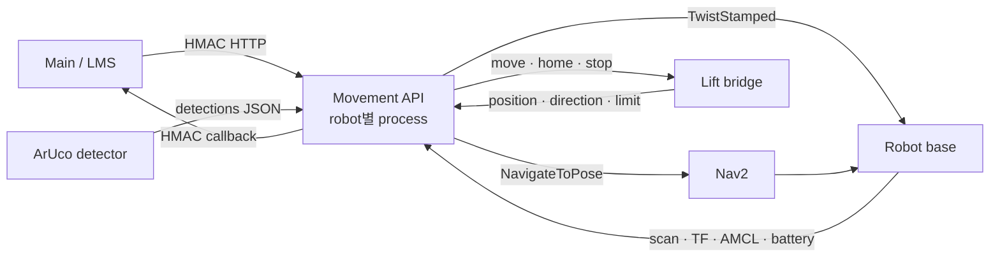
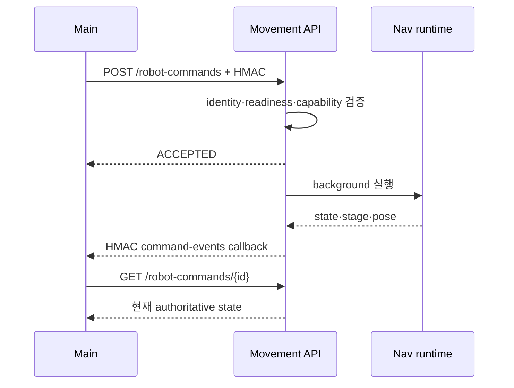
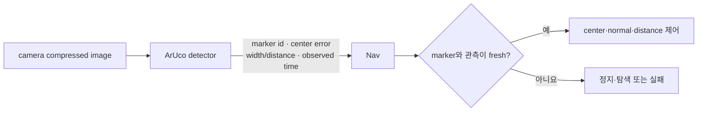

# Navigation Server 인터페이스

이 문서는 Nav가 Main·Robot SBC·Vision·lift와 주고받는 현재 계약을 설명한다.
Nav 내부 실행 순서는 [핵심 알고리즘](NAV_ALGORITHM.md), 프로필별 값은
[런타임](RUNTIME.md)을 따른다.

## 한눈에 보는 연결 구조

## 기본 원칙

- 로봇 하나는 하나의 Movement API endpoint와 active robot profile에 대응한다.
- 현재 운영 mutation endpoint는 Main HMAC 서명이 필요하다. legacy mission은 운영 ingress로 사용하지 않는다.
- GET health·상태·지도 조회는 read-only 진단 표면이다.
- 업무 시퀀스는 Main이 소유하고 Nav는 원자 명령 하나의 상태만 보고한다.
- ROS topic 이름과 domain은 `config/robots.json`과 선택 프로필이 정본이다.
- callback 목적지는 요청자가 임의로 정하지 못하며 설정된 Main endpoint만 허용한다.

## Main이 사용하는 HTTP API

### 현재 운영 기준

| 목적 | method와 path | 핵심 결과 |
| --- | --- | --- |
| endpoint 발견 | `GET /robots`, `GET /movement-api/v1/endpoints` | robot과 API endpoint |
| readiness | `GET /movement-api/v1/health` | localization·Nav2·robot·lift 상태 |
| 원자 명령 접수 | `POST /robot-commands` | `ACCEPTED` 또는 거절 사유 |
| 명령 조회 | `GET /robot-commands/{command_id}` | 현재 state·stage·message |
| 명령 취소 | `POST /robot-commands/{command_id}/cancel` | `CANCELED` 또는 정지 실패 |
| pose·현지화 | `GET .../pose`, `GET .../localization` | map pose와 localization gate |
| 전역 탐색 | `POST .../localization/global-search` | 탐색 시작 승인 |
| 초기 pose | `POST .../initial-pose` | AMCL 초기 pose 적용 승인 |
| map·waypoint | `GET .../map-state`, `GET .../waypoints` | map identity와 목표점 |
| 안전 | `POST /robot/estop`, `POST /robot/clear_estop` | 비상정지 상태 |
| lock 진단 | `GET /traffic/locks`, `GET /zones/locks` | 현재 자원 점유 |

`...`는 `/movement-api/v1/robots/{robot_name}`를 뜻한다. 전역 탐색의 HTTP
응답은 시작 승인이지 `LOCALIZED` 완료가 아니다. 완료 여부는 localization을
polling해 확인한다.

### 원자 명령

공통 필드는 `command_id`, `robot_id`, 선택 `task_id`, `kind`, `params`,
선택 `callback_url`, `dry_run`이다.

| kind | 대표 params | 완료 상태 |
| --- | --- | --- |
| `move_to_point` | `waypoint_id` 또는 map 좌표, 선택 traffic segments | `ARRIVED` |
| `dock_transfer` | marker, `action=load\|unload`, level | `DONE` |
| `aruco_align` | marker, final 정렬 방식 | `DONE` |
| `leave_dock` | 선택 `force` | `DONE` |
| `manual_drive` | direction/command와 제한 시간 | `DONE` |
| `estop` | `op=stop` 또는 지원 동작 | 동작 결과 |

속도·센서 freshness·metric docking 보정값은 서버가 소유한다. Main은 업무상
목표와 marker/action/level을 보내며 안전 파라미터를 우회하지 않는다.

### 호환·commissioning 명령

| kind | 범위 |
| --- | --- |
| `undock` | `leave_dock`으로 처리하는 기존 호출 호환 alias |
| `reverse_out` | `slot_reverse_out`으로 처리하는 commissioning·시나리오 복구 명령 |

두 명령은 `/robot-commands`가 수용하지만 현재 Main dispatch 계약에는 포함하지
않는다. `reverse_out`은 삽입 상태와 후방 안전 조건을 확인한 검증 절차에서만
사용한다.

## 명령 상태와 callback

| 상태 | 의미 |
| --- | --- |
| `ACCEPTED` | admission을 통과하고 실행 대기 |
| `RUNNING` | 현재 step 실행 중 |
| `ARRIVED` | approach 도착, 후속 dock/align gate 대기 |
| `DONE` | 원자 동작 완료 |
| `FAILED` | 실행 오류 |
| `ABORTED` | E-stop, timeout 또는 안전 조건으로 중단 |
| `CANCEL_REQUESTED` | 정지 확인 중 |
| `CANCELED` | 물리 정지 확인 후 취소 완료 |
| `STOP_UNCONFIRMED` | 물리 정지를 확인하지 못한 위험 상태 |

callback에는 `command_id`, `task_id`, robot 식별자, state, stage, reason,
pose, simulation/evidence 정보가 포함될 수 있다. callback 전송 실패는 이미 끝난
물리 동작을 되돌리지 않으므로 Main은 명령 조회로 상태를 복구한다.

## 인증과 callback 경계

현재 운영 mutation endpoint는 다음 헤더를 검증한다.

- `X-SF-Timestamp`
- `X-SF-Nonce`
- `X-SF-Signature`

서명 payload는 HTTP method, query를 포함한 canonical path, timestamp, nonce,
body SHA-256으로 구성한다. timestamp 허용 범위를 벗어나거나 nonce가 재사용되면
거절한다. secret이 없을 때는 fail-closed한다.

Nav→Main callback도 HMAC으로 서명한다. callback adapter는 설정된 Main base와
`/movement/command-events`, `/movement/results`, robot status 경로만 허용하고
redirect, query, 사용자 정보가 들어간 URL을 거절한다.

## ROS 로봇 인터페이스

| 방향 | topic/action | 용도 |
| --- | --- | --- |
| Robot → Nav | `map → base_link` TF | 현재 map pose의 우선 소스 |
| Robot → Nav | `/amcl_pose` | TF 실패 시 pose와 localization covariance |
| Robot → Nav | scan, battery, emergency, obstacle 상태 | 이동 admission과 health |
| Nav → Nav2 | `NavigateToPose` | waypoint별 goal 실행 |
| Nav → Robot | `/cmd_vel` `TwistStamped` | 정밀 도킹·수동 저속 제어·정지 |
| Nav → AMCL | `/initialpose` | 승인된 초기 pose 적용 |
| Nav → Nav2 | action cancel | 취소·E-stop·실패 시 자율 이동 중단 |

여러 waypoint도 `NavigateToPose`를 순차 호출한다. robot 이름 prefix가 붙은
`/{robot}/cmd_vel`이나 ROS status topic을 별도로 만들지 않는다. 로봇 분리는
선택 프로필의 ROS domain으로 처리한다.

## Vision과 ArUco

검출 메시지는 로봇별 `/mission/tb3_{n}/aruco/detections`에서 JSON으로 받는다.
핵심 값은 marker ID, 중심 오차, marker 폭/거리 추정, 관측 시각이다. Nav는 현재
단계가 요구하는 marker와 freshness를 다시 확인하며 Vision이 도킹 성공을 직접
결정하지 않는다.

## Lift 인터페이스

| 방향 | topic | 의미 |
| --- | --- | --- |
| Nav → lift | `/lift/cmd_move` | 목표 높이 이동 |
| Nav → lift | `/lift/cmd_home` | home 동작 |
| Nav → lift | `/lift/cmd_stop` | 즉시 정지 |
| lift → Nav | `/lift/position` | 현재 높이 |
| lift → Nav | `/lift/direction` | 이동 방향 |
| lift → Nav | `/lift/limit_lower` | 하단 limit 상태 |

physical backend는 command subscriber와 최신 telemetry가 모두 있어야 ready다.
virtual backend는 synthetic HIL에서만 허용되며 physical lift 증거가 아니다.

## Lock과 공통 식별자

traffic lock은 `segment_id + robot_id + command_id` 소유권을 사용한다. zone
lock은 `zone_id + robot_id`와 선택 mission ID를 사용한다. release는 소유자가
일치해야 하며 이전 명령이 다음 명령의 lock을 지울 수 없다.

| 식별자 | 소유자와 용도 |
| --- | --- |
| `robot_id` / `robot_name` | 프로필과 endpoint에서 로봇을 선택 |
| `command_id` | Nav 실행·중복 방지·polling·callback 기준 |
| `task_id` | Main 업무와 Nav 명령의 상관관계 |
| `waypoint_id` | `map/zones.json`의 map 목표 |
| `marker_id` | approach·ArUco·slot 설정 연결 |

## 호환 인터페이스

`POST /movement-api/v1/commands`, `/routes/preview`, `/routes/commands`,
`GET /robot/status`, `POST /mission/start`는 기존 연동과 로컬 검증을 위한
호환 표면이다. 특히 legacy mission은 현재 HMAC ingress 정본이 아니므로 외부에
노출하지 않는다. 새 Main 흐름은 `/robot-commands`를 사용한다.

## 구현 근거

- [`nav_app/routers/`](../../nav_app/routers/) — HTTP route
- [`nav_app/models/requests.py`](../../nav_app/models/requests.py) — 요청 모델
- [`nav_app/security.py`](../../nav_app/security.py) — Main HMAC
- [`nav_app/adapters/callbacks.py`](../../nav_app/adapters/callbacks.py) — callback 제한
- [`nav_app/services/logistics_navigator.py`](../../nav_app/services/logistics_navigator.py) — ROS/Nav2 adapter
