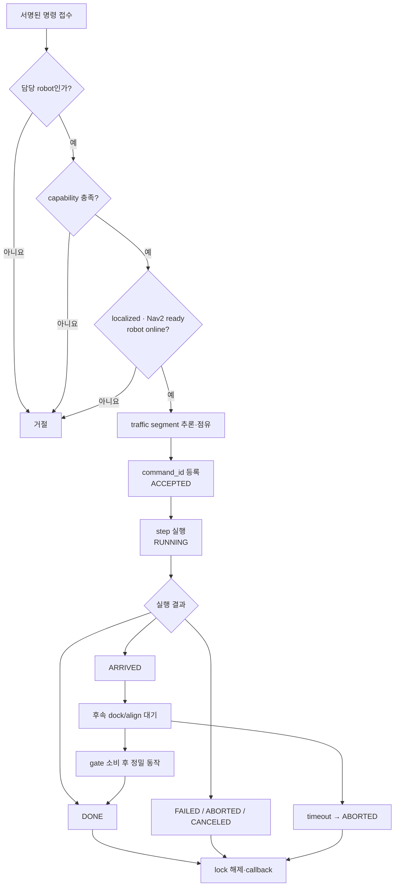
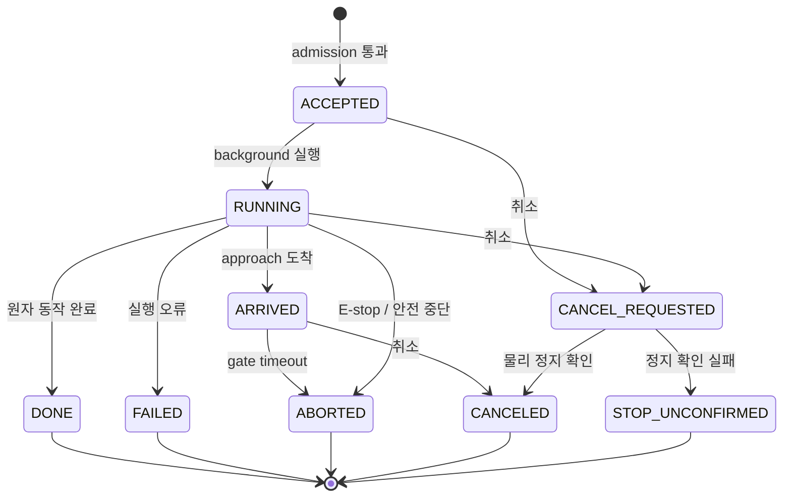
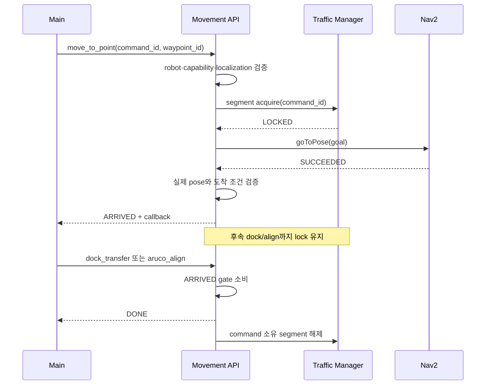
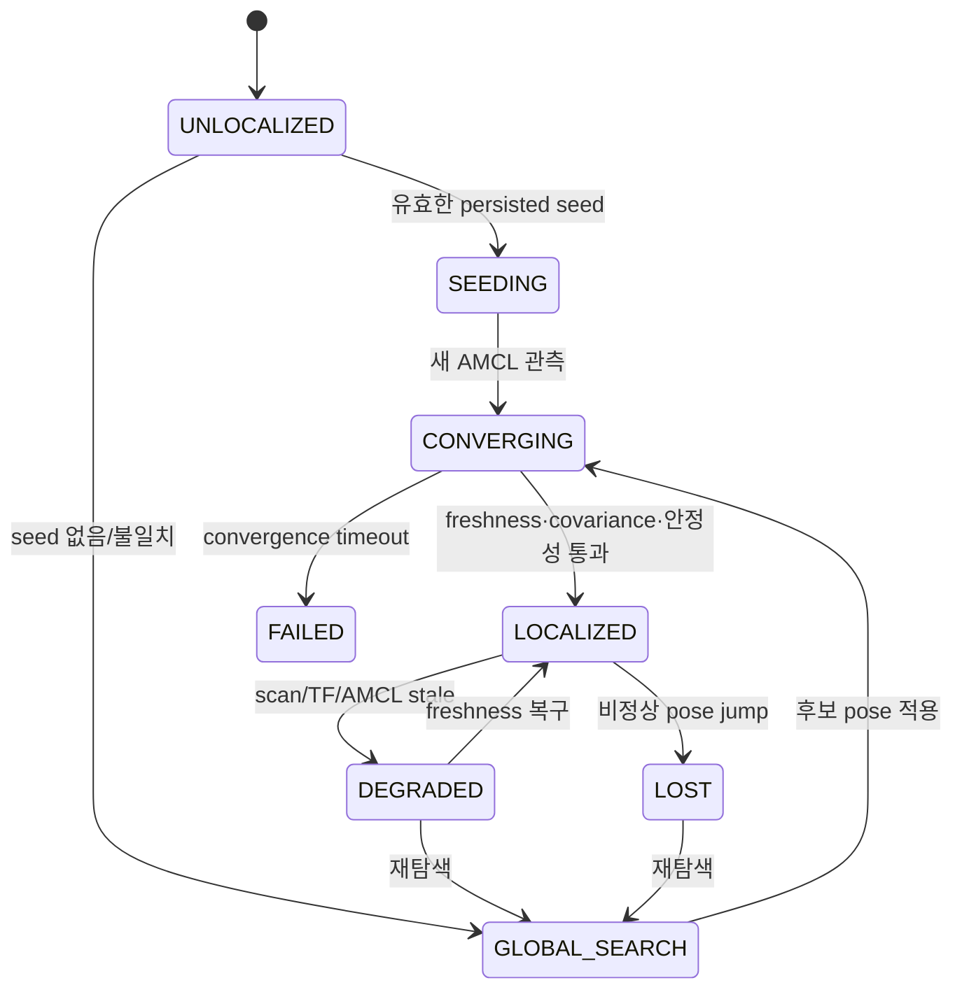
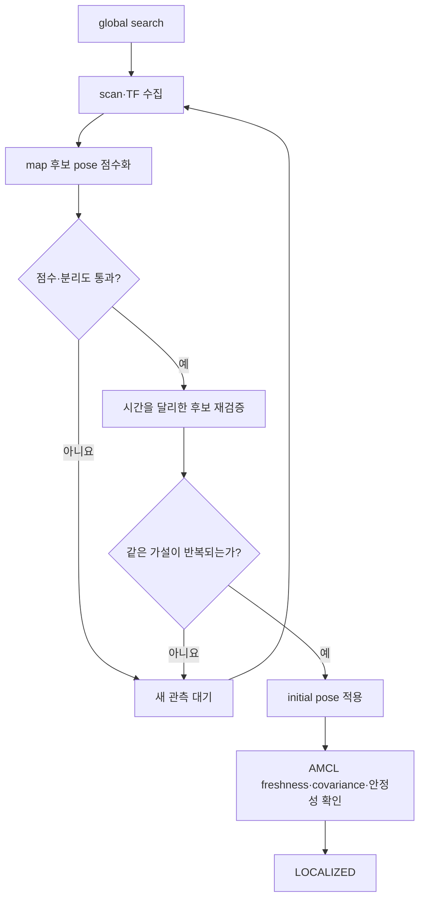
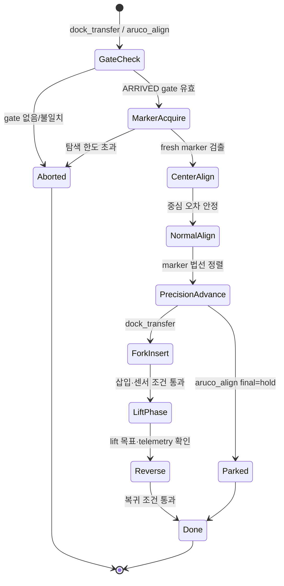
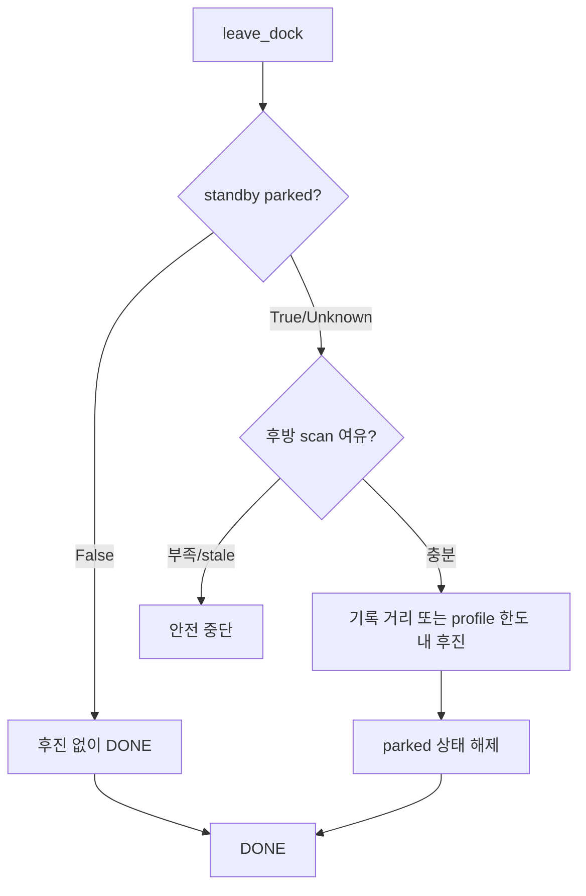

# Navigation Server 핵심 알고리즘

이 문서는 Nav가 Main의 원자 명령을 실제 로봇 동작으로 바꾸는 현재 알고리즘을
설명한다. HTTP 필드와 ROS topic은 [인터페이스](INTERFACES.md), 프로필과
준비 상태는 [런타임](RUNTIME.md), 실행 명령은 [운영](../runbook/OPERATIONS.md)을
따른다.

## 핵심 원칙

- Main이 업무 시퀀스를 소유하고 Nav는 한 번에 하나의 원자 명령을 실행한다.
- 실제 이동은 현지화·Nav2·로봇 연결·capability gate를 모두 통과해야 한다.
- `move_to_point`와 도킹 명령은 `ARRIVED` gate로 연결한다.
- traffic lock은 명령 소유권과 함께 유지하고 terminal 상태에서 해제한다.
- 센서가 stale하거나 물리 정지가 확인되지 않으면 성공으로 진행하지 않는다.
- 설정값은 코드와 `config/robots.json`, `map/zones.json`을 정본으로 삼는다.

## 전체 흐름

## 명령 접수와 상태

현재 Main 연동 기준은 `POST /robot-commands`다.

| kind | Nav가 실행하는 핵심 동작 | 정상 terminal 상태 |
| --- | --- | --- |
| `move_to_point` | waypoint/좌표 해석, traffic lock, Nav2 이동 | `ARRIVED` |
| `dock_transfer` | ArUco 정렬, 삽입, lift, 후진 | `DONE` |
| `aruco_align` | ArUco 기반 정렬 또는 대기 주차 | `DONE` |
| `leave_dock` | parked 상태 확인, 안전 후진 또는 no-op | `DONE` |
| `manual_drive` | 제한된 저속 직접 속도 명령 | `DONE` |
| `estop` | Nav2·base·lift 정지 | `DONE` 또는 중단 상태 |

같은 `command_id`가 다시 들어오면 새로 실행하지 않고 기존 상태를 반환한다.
같은 로봇에 `ACCEPTED` 또는 `RUNNING` 명령이 있으면 새 실행을 `409`로
거절한다. 취소가 접수보다 먼저 도착한 경우에도 cancel tombstone을 남겨 뒤늦은
동일 명령 실행을 막는다.

필요한 traffic segment가 다른 명령에 점유되어 있으면 실행을 시작하지 않고
`WAITING_TRAFFIC`을 반환한다. 이 값은 명령의 영속 상태가 아니라 admission
결과이며, lock이 해제된 뒤 Main이 같은 업무 흐름에서 명령을 다시 요청한다.

## 이동과 ARRIVED gate

`move_to_point`가 `waypoint_id`를 받으면 `map/zones.json`에서 좌표·yaw와
semantic zone을 찾는다. 좌표를 직접 받을 수도 있지만, traffic segment 자동
추론이 어려우면 요청에 segment를 명시해야 한다.

Nav는 여러 goal도 `NavigateThroughPoses` 한 번으로 보내지 않고
`BasicNavigator.goToPose()`를 순서대로 실행한다. 실제 경로는 Nav2
planner/controller/costmap이 계산하며 Nav는 목적지와 실행 순서만 소유한다.

ARRIVED gate에는 접근 명령, marker, return pose, metric docking profile 같은
후속 동작 근거가 저장된다. 후속 `dock_transfer` 또는 `aruco_align`은 같은
로봇의 유효한 gate를 소비해야 한다. timeout이 지나면 접근 위치에서 정지한 채
`ABORTED`가 되고 lock을 해제한다.

이전 명령이 해제하려는 segment를 같은 로봇의 다음 명령이 이미 인계받았다면
이전 명령은 새 소유권을 삭제하지 않는다.

## 현지화 승인

현지화는 pose 한 건의 존재 여부가 아니라 scan·TF·AMCL을 함께 평가하는
상태 머신이다.

승인 조건은 다음과 같다.

1. scan, TF, AMCL 수신 시각이 프로필의 freshness 한도 안에 있다.
2. TF가 연속적이고 AMCL covariance가 허용 범위 안에 있다.
3. 서로 다른 최신 샘플이 필요한 횟수와 시간 동안 안정적이다.
4. 이미 승인된 뒤에는 정상 주행 자체를 pose jitter로 오인하지 않는다.
5. 큰 pose jump, stale sensor, map identity 불일치는 fail-closed 처리한다.

전역 탐색의 기본 전략은 로봇을 움직이지 않는 `observe_only`다. scan-map
alignment는 map의 장애물 거리장과 laser scan 후보 pose를 비교하고, 반복
관측에서 일관된 후보만 선택한다. 후보가 모호하거나 점수가 부족하면 initial
pose를 발행하지 않는다. 제한 이동 탐색은 명시적 허용과 전·후방 여유가 있을
때만 가능하다.

## ArUco 정렬과 도킹

도킹은 Nav2 접근과 정밀 동작을 분리한다. Nav2가 approach까지 이동한 뒤에만
ArUco 기반 저속 제어를 시작한다.

각 저속 velocity burst 전에 scan·TF·현지화 freshness를 다시 확인한다.
marker가 필요한 단계에서는 ArUco freshness도 함께 확인한다. 정밀 진입은
검증된 profile이 선택한 pixel/odometry 또는 metric 방식만 사용하며, 외부
요청이 속도·freshness·metric 보정값을 임의로 덮어쓸 수 없다.

`dock_transfer`의 lift 단계는 robot capability와 backend readiness가 모두
필요하다. lift telemetry가 stale하거나 목표 도달을 확인할 수 없으면 base와
lift를 정지하고 실패 처리한다.

## 대기 도킹 이탈

`aruco_align(final=hold)`이 완료되면 Nav는 대기 도킹 여부와 실제 전진 거리를
기억한다. `leave_dock`은 다음 순서로 처리한다.

`force=true`는 parked 판단을 우회할 수 있지만 후방 안전 검사까지 우회하지
않는다.

## 수동 제어와 안전 선점

수동 제어를 시작하기 전에 활성 Nav2 task를 취소하고 제한된 속도·시간만
허용한다. 수동 제어는 자율 명령과 동시에 실행하지 않는다.

취소와 E-stop은 다음 순서로 처리한다.

1. 취소는 대상 명령과 연결된 ARRIVED gate를 제거한다. E-stop은
   `ACCEPTED`/`RUNNING` 명령을 선점한다.
2. Nav2 task를 취소하고 base에 0 속도를 보낸다.
3. 활성 lift가 있으면 lift stop을 요청한다.
4. 정지가 확인되면 `CANCELED` 또는 `ABORTED`를 보고한다.
5. 물리 정지를 확인하지 못하면 `STOP_UNCONFIRMED`로 남기고 E-stop을 건다.
6. 해당 명령이 소유한 traffic lock만 해제한다.

## 호환 기능과 실험 기능

`/movement-api/v1/commands`, `/routes/preview`, `/routes/commands`,
`/mission/start`는 기존 호출을 위한 호환 표면이다. 운영 Main은 원자 명령
순서를 직접 소유하며 item 이름으로 큰 route를 자동 펼치지 않는다.

`undock`은 `leave_dock`의 호환 alias다. `reverse_out`은 내부적으로
`slot_reverse_out`을 실행하는 commissioning·시나리오 복구 명령이다. 두 이름은
현재 Main dispatch 계약에 포함하지 않으며, 특히 `reverse_out`은 삽입 상태와
후방 여유를 확인한 제한된 검증 절차에서만 사용한다.

AGV graph planner와 orthogonal follower는 독립 실행 가능한 실험 기능이다.
현재 Movement API dispatch와 연결되지 않았으므로 운영 알고리즘이나 합격
근거로 사용하지 않는다.

## 반드시 유지할 규칙

- 실제 이동은 `localized=true`, `nav2_ready=true`, `robot_online=true`에서만 허용한다.
- `dock_transfer`와 정식 `aruco_align`은 유효한 ARRIVED gate를 요구한다.
- marker·scan·TF·lift telemetry가 stale하면 저속이라도 계속 움직이지 않는다.
- terminal callback 실패가 물리 동작을 되돌리지는 않으며 Main은 polling으로 복구할 수 있어야 한다.
- synthetic HIL의 virtual lift 결과를 physical lift 증거로 승격하지 않는다.
- Nav2 경로 품질은 검증된 waypoint와 costmap 설정으로 관리하며 임의 RViz goal을 운영 경로로 간주하지 않는다.

## 구현 근거

- [`nav_app/routers/robot_commands.py`](../../nav_app/routers/robot_commands.py) — 명령 admission·상태·취소 API
- [`nav_app/services/robot_commands.py`](../../nav_app/services/robot_commands.py) — 명령 계획과 실행 단계
- [`nav_app/services/movement_executor.py`](../../nav_app/services/movement_executor.py) — Nav2·저속 동작 실행
- [`nav_app/services/command_state.py`](../../nav_app/services/command_state.py) — 명령 상태와 ARRIVED gate
- [`nav_app/services/localization.py`](../../nav_app/services/localization.py) — 현지화 승인 상태 머신
- [`nav_app/services/docking.py`](../../nav_app/services/docking.py) — ArUco 정렬과 도킹
- [`nav_app/services/safety.py`](../../nav_app/services/safety.py) — 취소·E-stop·정지 확인
- [`scripts/logistics_navigator.py`](../../scripts/logistics_navigator.py) — ROS/Nav2 adapter
