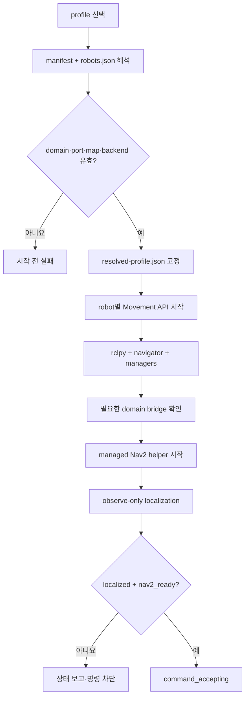
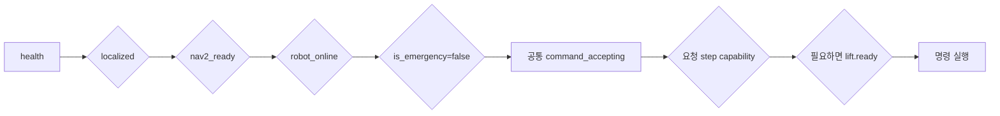

# Navigation Server 런타임

이 문서는 Nav 프로세스가 어떤 로봇·ROS domain·지도·lift backend로 시작하고
언제 명령을 받을 수 있는지 설명한다. 전체 서비스 시작 순서는
[루트 운영 문서](../../../docs/operations/startup-shutdown.md), Nav 단독 명령은
[운영](../runbook/OPERATIONS.md)을 따른다.

## 프로필 선택

선택 우선순위는 CLI `--profile`, `SF_NAV_PROFILE`, manifest 기본값 순서다.
기본값은 `tb1-live`이며 다른 프로필은 명시적으로 선택한다.

| 프로필 | 실행 의도 | lift backend | evidence |
| --- | --- | --- | --- |
| `tb1-live` | TB1 물리 실행 | physical | 실행별 물리 검증 필요 |
| `tb2-live` | TB2 물리 실행 | physical | 실행별 물리 검증 필요 |
| `all-live` | 두 로봇 동시 관리 | robot별 physical | 실행별 물리 검증 필요 |
| `tb1-synthetic-hil` | 실제 주행 경로 + virtual lift 시험 | virtual | nonphysical |

프로필은 실행 의도를 선택하며 로봇 하드웨어 사실을 복제하지 않는다. robot ID,
domain, port, topic, capability, localization, lift 설정은 `config/robots.json`이
정본이다.

## 시작 생명주기

`sf_nav.sh`는 시작할 때 해석한 프로필 snapshot을 `.runtime/sf-nav/` 아래에
고정한다. 프로세스 실행 중 저장소 설정이 바뀌어도 현재 실행은 이 snapshot을
계속 사용한다.

Movement API의 FastAPI lifespan은 다음 객체를 초기화한다.

- `LogisticsNavigator`와 ROS `SingleThreadedExecutor`
- `MissionManager`, `TrafficManager`, `ZoneLockManager`
- 로봇 프로필에 맞는 lift backend
- ROS spin thread와 Nav2 readiness monitor

종료할 때 detector를 비활성화하고 Nav2 task를 취소한 뒤 executor와 rclpy를
정리한다.

## readiness와 명령 승인

| 상태 | 판단 근거 | 실패 시 |
| --- | --- | --- |
| `localized` | scan·TF·AMCL freshness, covariance, 안정성 | 실제 이동 `409` |
| `nav2_ready` | lifecycle/action readiness monitor | 실제 이동 `503` |
| `robot_online` | `/cmd_vel` subscriber와 robot identity | 실제 이동 `503` |
| `is_emergency` | navigator safety와 mission 상태 | 명령 차단 |
| `capabilities` | active robot profile | 지원하지 않는 step `409` |
| `lift.ready` | backend, subscriber, 최신 telemetry | lift step 중단 |
| `command_accepting` | localization·Nav2·robot·비상 상태의 공통 종합 | `false`면 Main dispatch 금지 |

capability와 lift readiness는 `command_accepting` 값에 포함되지 않는 명령별
추가 gate다.

simulation 또는 명시적인 dry-run은 일부 물리 readiness를 우회할 수 있지만,
synthetic HIL은 `SIMULATION_MODE=0`을 유지한다. synthetic HIL은 lift만 virtual로
바꾸고 실제 Nav2·현지화·base 안전 admission을 그대로 사용한다.

## 설정과 데이터 정본

Nav는 업무용 관계형 DB를 소유하지 않는다. 실행에 필요한 기준정보는 다음
파일과 프로세스 상태로 관리한다.

| 정본 | 소유 내용 |
| --- | --- |
| `config/robots.json` | robot ID, domain, endpoint, capability, localization, lift |
| `config/runtime_profiles/manifest.json` | profile 이름과 기본 profile |
| `config/runtime_profiles/*.json` | 선택 robot, component ownership, backend, evidence class |
| `config/main_server_routes.json` | Main endpoint와 callback route |
| `config/domain_bridge/*.yaml` | ROS domain 간 전달 topic |
| `config/nav2/*.yaml` | Nav2 planner/controller/costmap |
| `map/zones.json` | waypoint, semantic zone, marker, traffic segment |
| `map/*.yaml`, `map/*.pgm` | 지도 metadata와 image |
| `config/inventory_locations.json` | 호환 route builder의 item-section 매핑 |

map-state는 map ID, YAML/image digest, resolution, origin, 크기로 identity를
만든다. Main이 사용하는 지도와 일치하지 않으면 dispatch 근거로 사용하지 않는다.
waypoint 좌표를 변경할 때는 실제 map pose와 traffic 의미를 함께 검증한다.

## 프로세스 메모리 상태

| 상태 | 역할 |
| --- | --- |
| `movement_commands` | command별 state·stage·callback·lock |
| `last_arrived_gate_by_robot` | 접근 완료와 후속 도킹 근거 |
| `active_movement_command_id` | 현재 실행 추적 |
| `standby_parked` | 대기 도킹 여부 |
| `standby_park_reverse_distance_m` | 주차 이탈에 사용할 실제 전진 거리 |
| traffic/zone manager | process lifetime 동안의 lock 소유권 |

이 상태는 영구 업무 기록이 아니다. Main이 작업과 명령 이력을 저장하며 Nav
재시작 뒤에는 로봇·현지화·lock 상태를 다시 확인해야 한다.

## Lift backend

| backend | 용도 | ready 조건 |
| --- | --- | --- |
| `physical` | 실제 lift bridge | capability, command subscriber, 최신 telemetry |
| `virtual` | synthetic HIL | 허용된 profile과 `SF_NAV_ALLOW_SYNTHETIC_HIL=1` |
| `disabled` | lift 없는 실행 | lift step을 승인하지 않음 |

physical profile을 선택했다는 사실만으로 lift가 검증되지는 않는다. health와
callback은 `physical_lift_verified=false`와 증거 사유를 유지하며 실제 합격은
루트 물리 E2E 절차가 판정한다.

## Runtime 산출물

| 경로 | 내용 | Git 포함 |
| --- | --- | --- |
| `.runtime/sf-nav/` | resolved profile, PID, state, runtime log | 아니요 |
| `.venv/`, cache | 재생성 가능한 개발 환경 | 아니요 |
| `logs/`, `worklog/` | 문맥과 함께 선별한 검증 증거 | 검토 후 |
| root `deliverables/` | 통합 전달 증거 | 검토 후 |

`.env`, secret, 원본 runtime log를 무심코 stage하지 않는다. 보존할 증거는 실행
조건·profile·결과를 함께 기록한 뒤 선별한다.

## 구현 근거

- [`config/runtime_profiles/`](../../config/runtime_profiles/) — 프로필 선언
- [`nav_app/config/runtime_profiles.py`](../../nav_app/config/runtime_profiles.py) — 프로필 해석
- [`nav_app/server_core.py`](../../nav_app/server_core.py) — startup/shutdown
- [`nav_app/runtime.py`](../../nav_app/runtime.py) — process 상태
- [`nav_app/services/capabilities.py`](../../nav_app/services/capabilities.py) — capability와 lift readiness
- [`nav_app/services/lift_backends.py`](../../nav_app/services/lift_backends.py) — backend와 evidence
