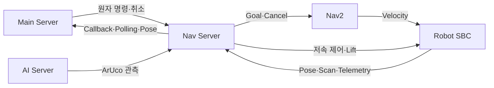
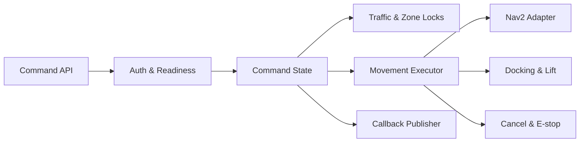

# Nav Server Responsibility

## Responsibility Summary

Nav Server는 Main이 보낸 원자 명령을 특정 로봇에서 안전하게 실행하는 서버입니다. 명령 admission부터 Nav2 주행, 도킹·리프트, 취소·정지 확인과 결과 보고까지 물리 실행 경계를 소유합니다.

| 구분 | 내용 |
| --- | --- |
| Owns | 원자 명령 인증·검증, 중복 처리와 실행 상태 |
| Owns | localization·Nav2·센서·장치 readiness admission |
| Owns | waypoint 주행, ArUco 정렬, 삽입·리프트·후진 |
| Owns | traffic segment와 작업 zone lock |
| Owns | 취소·E-stop 실행과 물리 정지 확인 |
| Owns | command polling, callback과 robot pose 보고 |
| Delegates to | Nav2: global·local path planning과 goal execution |
| Delegates to | AI Server: 최신 marker 관측 생성 |
| Does not own | 입출고 작업 생성, 로봇 할당과 다음 업무 단계 |
| Does not own | 재고·작업·이력의 업무 정본 |
| Does not own | 객체·화물·사람 인식 모델과 업무 판정 정책 |

## Responsibility Boundary

| Decision or State | Owner |
| --- | --- |
| 어떤 작업을 어느 로봇에 배정할지 | Main Server |
| 다음에 실행할 원자 명령 | Main Server |
| 명령을 현재 물리 상태에서 수락할지 | Nav Server |
| 경로, traffic·zone 점유와 도착 판정 | Nav Server |
| 도킹·리프트·취소의 물리 결과 | Nav Server |
| marker와 객체 관측 | AI Server |
| marker 관측을 조향에 적용할지 | Nav Server |
| 작업 완료와 재고 변경 | Main Server |
| 결과를 다음 업무 단계로 승격할지 | Main Server |

## Collaboration Diagram

## Internal Responsibility Diagram

## Design Rules

1. 같은 `command_id`의 재요청은 새 물리 동작을 만들지 않고 기존 상태를 반환합니다.
2. 한 로봇에는 하나의 활성 이동 명령만 허용하며, 실행 전 readiness를 확인합니다.
3. stale sensor·marker 관측과 localization 불명확은 성공이나 도착으로 간주하지 않습니다.
4. traffic·zone lock은 명령 소유권과 연결하고 모든 종료 경로에서 해제합니다.
5. 취소는 요청 수신이 아니라 물리 정지 확인까지 구분하며, 확인 실패는 `STOP_UNCONFIRMED`로 보고합니다.
