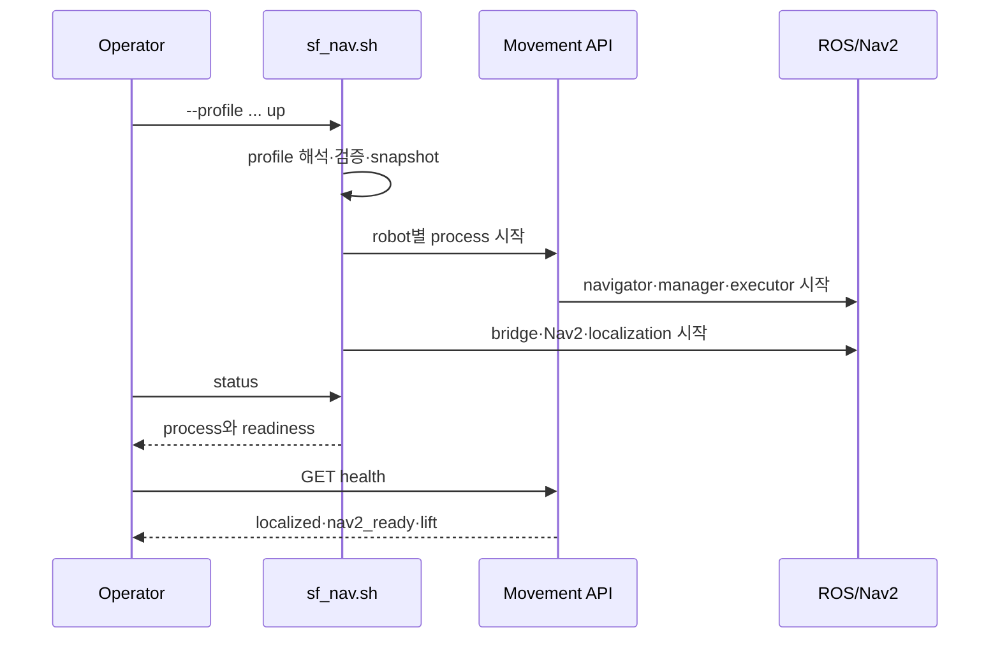
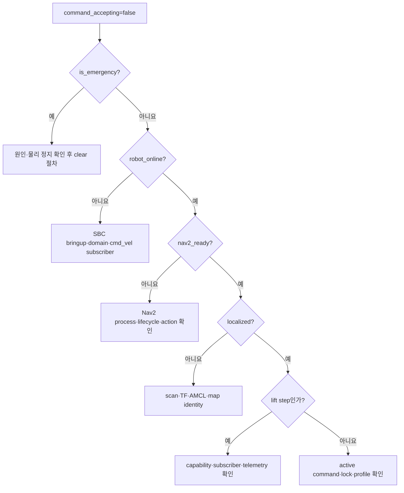

# Navigation Server 운영

이 문서는 `nav-server/`만 준비·시작·확인·진단·종료하는 절차다. Robot SBC,
Main, Vision을 포함한 전체 순서는 [저장소 시작·종료](../../../docs/operations/startup-shutdown.md),
실물 합격은 [물리 E2E 체크리스트](../../../docs/operations/physical-e2e-checklist.md)를
따른다.

## 안전 경계

- 실물 명령 전 `command_accepting`, `localized`, `nav2_ready`, `robot_online`,
  `is_emergency`, 필요 시 `lift.ready`를 확인한다.
- profile이나 active robot이 예상과 다르면 명령을 보내지 않는다.
- 사람이 E-stop에 접근하고 로봇을 관찰할 수 없는 상태에서 실물 이동을 시작하지 않는다.
- 여기의 smoke와 simulation 성공을 physical docking·lift 성공으로 해석하지 않는다.

## 환경 준비

```bash
cd nav-server
scripts/setup_nav_server_env.sh
```

ROS 2의 `rclpy`는 pip가 아니라 system ROS가 제공한다. 기본 ROS setup은
`/opt/ros/jazzy/setup.bash`이며 다른 설치는 `ROS_SETUP`으로 명시한다. `.env`와
현장 secret은 Git에 올리지 않는다.

## 프로필 확인과 preflight

```bash
cd nav-server
scripts/sf_nav.sh profiles
scripts/sf_nav.sh --profile tb1-live print-config
ROS_SETUP=/opt/ros/jazzy/setup.bash scripts/sf_nav.sh --profile tb1-live check
```

`print-config`에서 선택 robot, API port, hardware/local ROS domain, component
ownership, lift backend를 확인한다. `check`는 ROS setup, config, map, port,
실행 파일과 import를 검사하지만 프로세스를 시작하지 않는다.

## Robot SBC 전제

실물 profile은 선택 로봇의 SBC에서 base를 먼저 시작해야 한다. lift나 camera를
사용할 때만 각각의 helper를 별도 terminal에서 추가한다. 실제 domain과 overlay
경로는 `config/robots.json` 및 현장 설치와 일치시킨다.

```bash
ROS_DOMAIN_ID=<hardware-domain> WS_SETUP=<tb3-overlay>/install/setup.bash \
  scripts/robot_sbc/start_bringup.sh

ROS_DOMAIN_ID=<hardware-domain> LIFT_WS_SETUP=<lift-overlay>/install/setup.bash \
  scripts/robot_sbc/start_lift_bridge.sh

ROS_DOMAIN_ID=<hardware-domain> WS_SETUP=<tb3-overlay>/install/setup.bash \
  scripts/robot_sbc/start_camera.sh
```

이 helper는 SBC에서 실행하거나 Nav PC가 SSH로 전달한다. `sf_nav.sh`가 소유하는
process가 아니므로 `down`으로 종료되지 않는다. 종료는 SBC에서 명시적으로 실행한다.

```bash
scripts/robot_sbc/stop_stack.sh
```

전체 host 순서와 camera가 필요한 단계는 [저장소 시작·종료](../../../docs/operations/startup-shutdown.md)를 따른다.

## 시작과 준비 상태



백그라운드 시작:

```bash
scripts/sf_nav.sh --profile tb1-live up
scripts/sf_nav.sh --profile tb1-live status
```

현재 terminal에 연결해 실행하려면 `foreground`를 사용한다.

```bash
scripts/sf_nav.sh --profile tb1-live foreground
```

`all-live`나 synthetic HIL은 기본값에 의존하지 말고 항상 profile을 명시한다.
synthetic HIL은 추가로 `SF_NAV_ALLOW_SYNTHETIC_HIL=1`이 필요하며 lift 결과는
nonphysical이다.

## Health 확인

TB1/TB2 기본 endpoint 예시는 각각 `8001`, `8002`다. 실제 값은
`print-config`와 `/movement-api/v1/endpoints`가 정본이다.

```bash
curl -fsS http://localhost:8001/movement-api/v1/health | python3 -m json.tool
curl -fsS http://localhost:8001/movement-api/v1/endpoints | python3 -m json.tool
```

실물 명령 전 다음을 확인한다.

| 필드 | 기대값 |
| --- | --- |
| `active_robot_id`, `robot_name` | 선택 profile의 로봇 |
| `ros_domain_id`, `process_ros_domain_id` | resolved profile과 일치 |
| `dry_run`, `simulation_mode` | 물리 실행이면 `false` |
| `robot_online` | `true` |
| `localized` | `true`, reason은 정상 수렴 |
| `nav2_ready` | `true` |
| `is_emergency` | `false` |
| `command_accepting` | `true` |
| `capabilities` | 실행할 kind를 지원 |
| `lift.ready` | `dock_transfer` 전에 `true` |

## 현지화 확인

```bash
curl -fsS \
  http://localhost:8001/movement-api/v1/robots/tb3_1/localization \
  | python3 -m json.tool
```

`localized=false`이면 `reason`, scan/TF/AMCL age, covariance, sample count,
pose jitter를 먼저 확인한다. global search와 initial pose는 상태를 바꾸므로
서명된 Main 호출 또는 저장소의 관리형 흐름으로 실행한다. 시작 응답만 보고 이동
가능하다고 판단하지 말고 서로 다른 최신 관측이 수렴할 때까지 polling한다.

재탐색 중에는 다음 원칙을 지킨다.

1. 기본 `observe_only`로 시작한다.
2. map identity와 실제 로봇 위치가 맞는지 확인한다.
3. bounded motion은 명시적 허용과 전·후방 공간 확보 후에만 사용한다.
4. 이전 search가 아직 종료 중이면 새 worker를 겹쳐 실행하지 않는다.

## ArUco와 lift 확인

```bash
curl -fsS http://localhost:8001/movement-api/v1/aruco/latest \
  | python3 -m json.tool
```

marker ID뿐 아니라 관측 시각과 freshness, active robot topic을 확인한다. ArUco가
보이지 않으면 camera → detector → domain bridge → Movement topic 순서로 점검한다.

lift는 health의 `capable`, `enabled`, `backend`, `ready`, `reason`, telemetry를
확인한다. physical backend에서는 move/home/stop subscriber와 position/direction/
limit telemetry가 모두 필요하다. virtual backend의 `ready=true`는 실물 준비를
뜻하지 않는다.

## 대표 진단



| 증상 | 우선 확인 |
| --- | --- |
| `409 robot already has an active command` | 기존 command polling 또는 cancel |
| `409 WAITING_TRAFFIC` | lock owner와 command ID; 강제 release 전에 실제 로봇 위치 |
| localization `DEGRADED/LOST` | stale scan/TF/AMCL, pose jump, map identity |
| Nav2 `503` | lifecycle/action readiness와 managed child process |
| ArUco stale | camera, detector topic, marker ID, 관측 시간 |
| lift not ready | capability, backend, bridge subscriber, telemetry age |
| `STOP_UNCONFIRMED` | 로봇 접근 금지, E-stop 유지, 현장 물리 정지 확인 |
| callback 실패 | Main base/allowlist/HMAC; Nav command polling으로 상태 복구 |

상세 통합 장애 흐름은 [루트 troubleshooting](../../../docs/operations/troubleshooting.md)을
따른다.

## 로컬 검증

기본 검증은 compile, lint, unit/contract test와 config validator를 실행한다.

```bash
cd nav-server
scripts/check_all.sh
```

프로세스를 시작하지 않는 bringup 검증:

```bash
scripts/run_nav_servers.sh --print-plan
ROS_SETUP=/opt/ros/jazzy/setup.bash scripts/run_nav_servers.sh --check
```

실행 중인 simulation profile의 API smoke:

```bash
scripts/sf_nav.sh --profile tb1-live smoke
scripts/smoke_movement_api.sh
scripts/smoke_main_contract.sh
```

명령 취소·센서 freshness·E-stop·lift·현지화 핵심 회귀는 `tests/` 전체에 포함된다.
문제를 좁힐 때만 다음처럼 targeted test를 사용한다.

```bash
PYTEST_DISABLE_PLUGIN_AUTOLOAD=1 .venv/bin/python -m pytest -q \
  tests/test_nohardware_robot_command_contract.py \
  tests/test_docking_sensor_freshness.py \
  tests/test_nohardware_estop_lift_stop.py \
  tests/test_scan_map_alignment.py \
  tests/test_global_localization_search.py
```

## Gazebo 검증

설치된 ROS 2 Jazzy stock package의 Nav2·AMCL·`NavigateToPose`를 격리된 domain에서
검증한다. 실행기는 `nav2_minimal_tb3_sim` 패키지를 사용하며 실제 ArUco·Lift
hardware를 대신하지 않는다.

```bash
scripts/verify_gazebo_nav2_e2e.sh --check
scripts/verify_gazebo_nav2_e2e.sh
```

합격 조건은 lifecycle active, AMCL 수렴, `NavigateToPose SUCCEEDED`, 최종 map
pose 오차 한도 통과다. 이 결과는 ArUco, fork, lift, docking hardware를 검증하지
않는다.

## 로그와 종료

```bash
scripts/sf_nav.sh --profile tb1-live logs
scripts/sf_nav.sh --profile tb1-live down
scripts/sf_nav.sh --profile tb1-live status
```

전체 시스템은 먼저 활성 명령을 중단하고 로봇 정지를 확인한 뒤 루트 종료 순서를
따른다. `sf_nav.sh down`은 자신이 소유한 process group만 종료하며 외부 Robot SBC,
Main, Vision process를 임의로 종료하지 않는다.

## Waypoint 변경

실제 로봇을 안전하게 teleop으로 이동해 map pose를 확인한 뒤 기록한다.

```bash
scripts/record_waypoint_pose.py <waypoint-id>
scripts/validate_zones.py --scope field-e2e
```

변경 전후 `map/zones.json` backup과 diff를 확인한다. waypoint 변경은 Nav2 도착점,
traffic segment, ArUco approach, Main map binding에 영향을 줄 수 있으므로 루트 E2E
검증 없이 운영 합격으로 간주하지 않는다.
